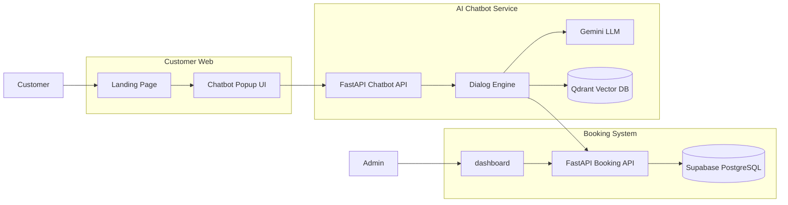

<div align="center">

# Booking AI System

**Nền tảng đặt lịch massage đa dịch vụ, hỗ trợ quản lý lịch theo thời gian thực,  
quy trình booking an toàn và trợ lý AI dành cho khách hàng.**

[](https://www.python.org/)
[](https://fastapi.tiangolo.com/)
[](https://nextjs.org/)
[](https://supabase.com/)
[](https://qdrant.tech/)
[](https://www.docker.com/)

[Kiến trúc](docs/architecture.md) ·
[Thiết kế API](docs/api-design.md) ·
[Thiết kế cơ sở dữ liệu](docs/database-design.md) ·
[Hướng dẫn cài đặt](#hướng-dẫn-cài-đặt)

</div>

---

## Tổng quan

Booking AI System là nền tảng đa dịch vụ dùng để quản lý cửa hàng massage và quy trình đặt lịch của khách hàng.

Hệ thống bao gồm:

- **FastAPI Booking Backend** — nơi chứa toàn bộ business rules và dữ liệu nghiệp vụ cốt lõi, được tổ chức theo kiến trúc phân lớp (api → services → repositories → db);
- **Next.js Frontend** — giao diện dành cho khách hàng và quản trị viên;
- **AI Chatbot Service** — trợ lý hội thoại độc lập, sử dụng Gemini để hiểu và tạo phản hồi tự nhiên, kết hợp Qdrant cho RAG và tra cứu tri thức, cùng Booking Backend API cho các nghiệp vụ đặt lịch;
- **Supabase PostgreSQL** — nơi lưu trữ dữ liệu giao dịch và booking.

Chatbot không truy cập trực tiếp vào các bảng booking. Những dữ liệu theo thời gian thực như shop, course, slot khả dụng và trạng thái booking đều được lấy thông qua Booking Backend API.

---

## Chức năng chính

- Quản lý cửa hàng, dịch vụ, kỹ thuật viên, ca làm việc và lịch booking.
- Kiểm tra lịch trống theo thời gian thực dựa trên chi nhánh, ngày, giờ, số người, thời lượng và dịch vụ.
- Hỗ trợ tạo, tra cứu, cập nhật và hủy booking với bước xác nhận rõ ràng.
- Kiểm tra thông tin khách hàng, hạng thành viên và danh sách hạn chế đặt lịch.
- Cung cấp dashboard quản trị để theo dõi lịch hẹn và dữ liệu vận hành.
- Tích hợp chatbot AI dạng popup để khách hàng đặt lịch bằng hội thoại tự nhiên và hỏi thông tin dịch vụ.

---

## Hình ảnh minh họa

### Giao diện quản trị booking

<details>
<summary>Xem thêm giao diện quản trị</summary>

<p align="center">
  
</p>

<p align="center">
  
</p>

<p align="center">
  
</p>

</details>

### Luồng chatbot đặt lịch

<details>
<summary>Xem đầy đủ flow chatbot booking</summary>

<p align="center">
  
  
  
</p>

<p align="center">
  
  
  
</p>

<p align="center">
  
  
  
</p>

<p align="center">
  
  
  
</p>

<p align="center">
  
</p>

</details>

### Truy xuất tri thức bằng RAG

<details>
<summary>Xem ví dụ chatbot trả lời bằng RAG</summary>

<p align="center">
  
  
  
  
</p>

</details>

---

## Kiến trúc hệ thống


```mermaid
flowchart LR
    Admin[Admin]
    Customer[Customer]

    subgraph Admin_System[Booking System]
        AdminFE[dashboard]
        POS[FastAPI Booking API]
        DB[(Supabase PostgreSQL)]
    end

    subgraph Customer_Web[Customer Web]
        Landing[Landing Page]
        ChatPopup[Chatbot Popup UI]
    end

    subgraph AI_Service[AI Chatbot Service]
        ChatAPI[FastAPI Chatbot API]
        Dialog[Dialog Engine]
        Gemini[Gemini LLM]
        Qdrant[(Qdrant Vector DB)]
    end

    Admin --> AdminFE
    AdminFE --> POS
    POS --> DB

    Customer --> Landing
    Landing --> ChatPopup
    ChatPopup --> ChatAPI

    ChatAPI --> Dialog
    Dialog --> Gemini
    Dialog --> Qdrant
    Dialog --> POS
```

### Nguyên tắc thiết kế

1. **Booking Backend là nguồn dữ liệu gốc (source of truth)**  
   Availability, eligibility và các business rules được validate bởi backend.

2. **Chatbot chỉ có quyền truy cập tối thiểu (least-privilege access)**  
   Nó chỉ gọi các public booking endpoint cần thiết và không thể gọi administration API.

3. **RAG data và transactional data được tách biệt**  
   Qdrant lưu FAQ, policy và documentation chunks. Customer và booking information vẫn nằm trong PostgreSQL.

4. **Mutation cần xác nhận (confirmation)**  
   Tạo, đổi lịch và hủy booking đều yêu cầu người dùng xác nhận rõ ràng trước khi API call được thực hiện.

5. **Các service có thể deploy độc lập**  
   Frontend, backend và chatbot mỗi service có runtime và container image riêng.

Xem thêm tại [Tài liệu kiến trúc](docs/architecture.md).

---

## Hướng dẫn cài đặt

### Yêu cầu hệ thống

Cần cài đặt:

- Python 3.11 trở lên
- Node.js 20 trở lên
- Docker và Docker Compose
- Một Supabase PostgreSQL project
- Gemini API key để chạy Chatbot

### Clone repository

```bash
git clone https://github.com/duy-debug/booking-ai-system.git
cd booking-ai-system
```

---

## Chạy toàn bộ hệ thống bằng Docker Compose

Cách khuyến nghị để khởi động toàn bộ môi trường local:

```bash
docker compose up --build
```

Các service:

| Service | Local URL |
|---|---|
| Frontend | `http://localhost:3000` |
| Chatbot Frontend | `http://localhost:3002` |
| Booking API | `http://localhost:8000` |
| Booking API documentation | `http://localhost:8000/docs` |
| Chatbot API | `http://localhost:8001` |
| Chatbot API documentation | `http://localhost:8001/docs` |
| Qdrant dashboard | `http://localhost:6333/dashboard` |

Dừng hệ thống:

```bash
docker compose down
```

Dừng hệ thống và xóa local Qdrant volume:

```bash
docker compose down -v
```

---

## Chạy từng service khi phát triển local

Mỗi service nên chạy ở một terminal riêng. Với mỗi block bên dưới, bạn chỉ cần đứng ở thư mục gốc `booking-ai-system`, copy nguyên block và chạy.

### 1. Booking Backend

```powershell
cd .\booking-ai-system-be
.\.venv\Scripts\Activate.ps1
pip install -e .
alembic upgrade head
python -m uvicorn app.main:app --reload --port 8000
```

Kiểm tra:

```text
Health:  http://localhost:8000/health
Swagger: http://localhost:8000/docs
OpenAPI: http://localhost:8000/openapi.json
```

### 2. Booking Frontend

```powershell
cd .\booking-ai-system-fe
npm run build
npx next start -p 3000
```

Mở trình duyệt tại:

```text
http://localhost:3000
```

### 3. AI Chatbot Backend

Qdrant và Booking Backend cần chạy trước Chatbot Backend.

```powershell
cd .\booking-ai-chatbot\backend
.\.venv\Scripts\Activate.ps1
pip install -e ".[dev,rag]"
python -m uvicorn app.main:app --reload --port 8001
```

Kiểm tra:

```text
Swagger: http://localhost:8001/docs
```

### 4. Chatbot Frontend

```powershell
cd .\booking-ai-chatbot\frontend
npm run build
npx next start -p 3002
```

Mở trình duyệt tại:

```text
http://localhost:3002
```

---

## Đóng góp

Dự án hiện đang được phát triển tích cực.

Trước khi tạo Pull Request:

1. Tạo một feature branch rõ ràng.
2. Giữ mỗi thay đổi tập trung vào một trách nhiệm.
3. Thêm hoặc cập nhật test liên quan.
4. Chạy toàn bộ test suite.
5. Ghi rõ các thay đổi liên quan đến API, database schema hoặc environment variables.

File `CONTRIBUTING.md` sẽ được bổ sung khi dự án ổn định hơn.

---

## License

Repository hiện chưa công bố open-source license.

Trước khi phát hành dưới dạng open source, hãy thêm file `LICENSE` với đúng tên chủ sở hữu bản quyền và năm phát hành.
