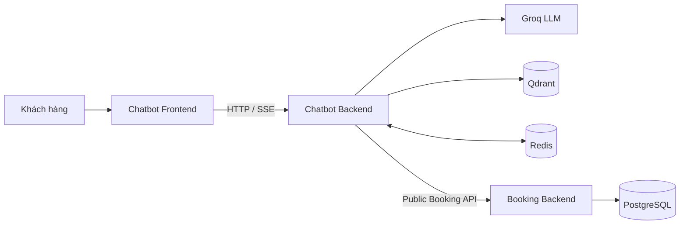
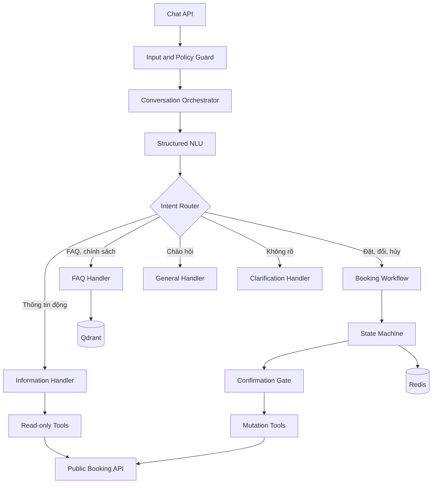

# Booking AI Chatbot

Hệ thống chatbot hỗ trợ khách hàng tìm hiểu dịch vụ và đặt, đổi, hủy lịch bằng
hội thoại.

Chatbot là một hệ thống độc lập với Booking Backend:

- Chatbot không truy cập trực tiếp PostgreSQL.
- Chatbot không sở hữu business rule booking.
- Booking Backend là source of truth.
- Dữ liệu động và mutation đều đi qua Public Booking API.
- Qdrant chỉ lưu FAQ, chính sách và tài liệu tri thức.

## 1. Kiến trúc tổng thể



| Thành phần | Công nghệ | Trách nhiệm |
|---|---|---|
| Chatbot Frontend | Next.js, React, TypeScript | Hiển thị hội thoại và lựa chọn booking |
| Chatbot Backend | FastAPI, Python | NLU, điều phối hội thoại, RAG và tool calling |
| Booking Backend | FastAPI, SQLAlchemy | Business rule, transaction và dữ liệu booking |
| Redis | Redis | Conversation state và pending confirmation |
| Qdrant | Qdrant | FAQ, chính sách và knowledge chunks |
| LLM | Groq | Structured NLU và diễn đạt câu trả lời đã xác minh |

## 2. Cấu trúc repository

```text
booking-ai-chatbot/
├── frontend/                       # Giao diện khách hàng
│   ├── app/                        # Next.js App Router
│   ├── components/
│   │   ├── chat/                   # Message list, input, streaming
│   │   ├── booking/                # Shop, course, slot, summary
│   │   └── common/
│   ├── services/                   # HTTP/SSE client gọi Chatbot Backend
│   ├── stores/                     # UI state và conversation ID
│   ├── schemas/                    # Zod validation
│   └── types/
│
├── backend/                        # Chatbot Backend
│   ├── app/
│   │   ├── api/                    # FastAPI router và Pydantic schema
│   │   ├── application/            # Orchestrator, NLU, router, workflow
│   │   ├── domain/                 # Intent, entity, state, pending action
│   │   ├── handlers/               # Information, booking, FAQ, general
│   │   ├── policies/               # Input guard và tool allowlist
│   │   ├── tools/                  # Read-only tools và mutation tools
│   │   ├── integrations/           # Booking API, Redis, Groq, Qdrant
│   │   ├── rag/                    # Ingestion, embedding, retrieval
│   │   ├── core/                   # Config và exception
│   │   └── main.py                 # Composition root
│   ├── docs/                       # Tài liệu nguồn để seed Qdrant
│   ├── tests/
│   ├── pyproject.toml
│   ├── Dockerfile
│   └── .env.example
│
└── README.md
```

Giao diện chatbot được viết trong `frontend/`. Backend Python không chứa React
component hoặc logic hiển thị.

## 3. Kiến trúc Chatbot Backend



Luồng phụ thuộc:

```text
API
└── Application
    ├── Domain
    ├── Handlers
    ├── Policies
    └── Tools
        └── Integrations
```

Các quy tắc:

1. `api` chỉ nhận request, gọi application và trả response.
2. `application` điều phối use case, không chứa HTTP hoặc database code.
3. `domain` không phụ thuộc FastAPI, Redis, Qdrant hoặc HTTPX.
4. `handlers` xử lý từng nhóm intent.
5. `tools` là danh sách năng lực chatbot được phép sử dụng.
6. `integrations` giao tiếp với hệ thống bên ngoài.
7. Transaction và kiểm tra xung đột luôn thuộc Booking Backend.

## 4. Luồng xử lý tin nhắn

```text
POST /api/chat
        ↓
Input Guard
        ↓
Structured NLU
        ↓
Intent Router
        ↓
Handler phù hợp
        ↓
Tool hoặc RAG
        ↓
Chat response
```

NLU chỉ trả dữ liệu có cấu trúc:

```json
{
  "intent": "create_booking",
  "resource": "booking",
  "operation": "create",
  "entities": {
    "booking_date": "2026-07-25",
    "start_time": "14:30"
  }
}
```

NLU không tự chọn URL và không trực tiếp tạo booking.

Frontend gửi một câu nói:

```json
{
  "conversation_id": "conversation-001",
  "query": "Tôi muốn đặt lịch"
}
```

Khi khách click một option, frontend gửi lựa chọn có cấu trúc thay vì gửi label:

```json
{
  "conversation_id": "conversation-001",
  "selection": {
    "entity": "shop_id",
    "value": "shop-uuid"
  }
}
```

Response cung cấp UI contract để frontend chọn component cần render:

```json
{
  "conversation_id": "conversation-001",
  "intent": "create_booking",
  "answer": "Bạn muốn đặt tại cửa hàng nào?",
  "missing_entities": ["shop_id"],
  "ui": {
    "type": "shop_options",
    "options": [
      {
        "id": "shop-uuid",
        "label": "東京中央店",
        "description": "東京都中央区",
        "metadata": {}
      }
    ],
    "data": {}
  }
}
```

## 5. Luồng tạo booking

```text
Thu thập shop, course, add-on, số người, ngày và giờ
        ↓
Read-only tool kiểm tra eligibility và availability
        ↓
Booking một người chọn auto, therapist cụ thể hoặc giới tính
Booking nhóm luôn dùng auto assignment
        ↓
Thu thập thông tin khách hàng
        ↓
Hiển thị booking summary
        ↓
Khách hàng xác nhận
        ↓
Mutation tool gọi Booking Backend với Idempotency-Key
        ↓
Booking Backend kiểm tra lại trong transaction
        ↓
Trả kết quả chính thức
```

Availability từ bước đầu chỉ là pre-check. Booking Backend phải kiểm tra lại tại
thời điểm ghi dữ liệu.

Confirmation token:

- Gắn với `conversation_id`.
- Gắn với action và bản chụp payload.
- Có thời hạn.
- Chỉ dùng một lần.
- Chỉ bị xóa sau khi mutation thành công.

Conversation state được lưu trong Redis bằng optimistic concurrency. Hai request
cùng sửa một phiên sẽ không được phép âm thầm ghi đè state của nhau.

## 6. Ranh giới Frontend

Frontend được phép:

- Gửi tin nhắn đến Chatbot Backend.
- Nhận JSON hoặc SSE stream.
- Hiển thị shop, course, slot và booking summary.
- Gửi lựa chọn hoặc confirmation của khách hàng.
- Giữ UI state và `conversation_id`.

Frontend không được:

- Gọi trực tiếp API tạo, đổi hoặc hủy của Booking Backend.
- Tự tính availability.
- Tự phân công therapist.
- Tự kiểm tra business rule.
- Lưu service key hoặc admin token.

## 7. Ranh giới dữ liệu và bảo mật

- Giá, shop, course, slot và booking lấy từ Booking Backend.
- FAQ và chính sách lấy từ Qdrant.
- Chatbot khách hàng không đăng ký tool quản trị.
- Mutation yêu cầu xác thực khách hàng và confirmation.
- Chatbot Backend và Booking Backend đều cần rate limit.
- Log phải che số điện thoại, OTP, token và API key.
- Mỗi request nên có `X-Correlation-ID`.

## 8. Chạy Chatbot Backend

```powershell
cd booking-ai-chatbot\backend
python -m venv .venv
.\.venv\Scripts\Activate.ps1
pip install -e ".[dev]"
Copy-Item .env.example .env
uvicorn app.main:app --reload --port 8001
```

Các endpoint:

```text
Health:  http://localhost:8001/health
Swagger: http://localhost:8001/docs
Chat:    POST http://localhost:8001/api/chat
```

Chạy test:

```powershell
cd booking-ai-chatbot\backend
python -m pytest -q
```

## 9. Biến môi trường Backend

```env
GROQ_API_KEY=
GROQ_MODEL=llama-3.3-70b-versatile
GROQ_BASE_URL=https://api.groq.com/openai/v1

QDRANT_HOST=localhost
QDRANT_PORT=6333
QDRANT_COLLECTION=kb_chunks

REDIS_URL=redis://localhost:6379/0
CONVERSATION_TTL_SECONDS=1800
BUSINESS_TIMEZONE=Asia/Tokyo

BOOKING_API_URL=http://localhost:8000
BOOKING_API_SERVICE_KEY=

ADMIN_API_KEY=change-me-in-production
CHATBOT_DEBUG=false
CORS_ORIGINS=http://localhost:3000
```
