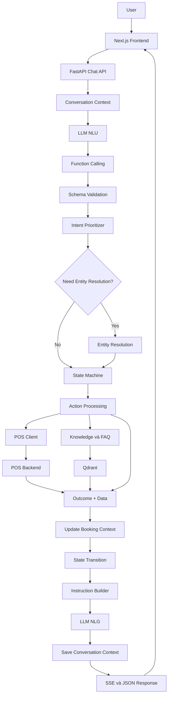
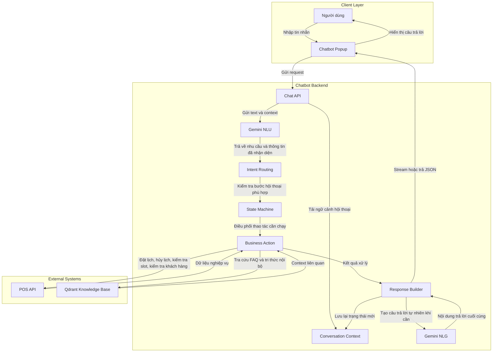
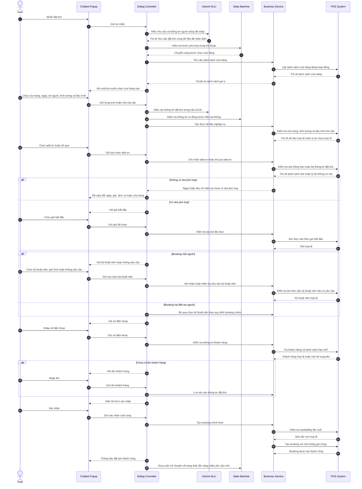
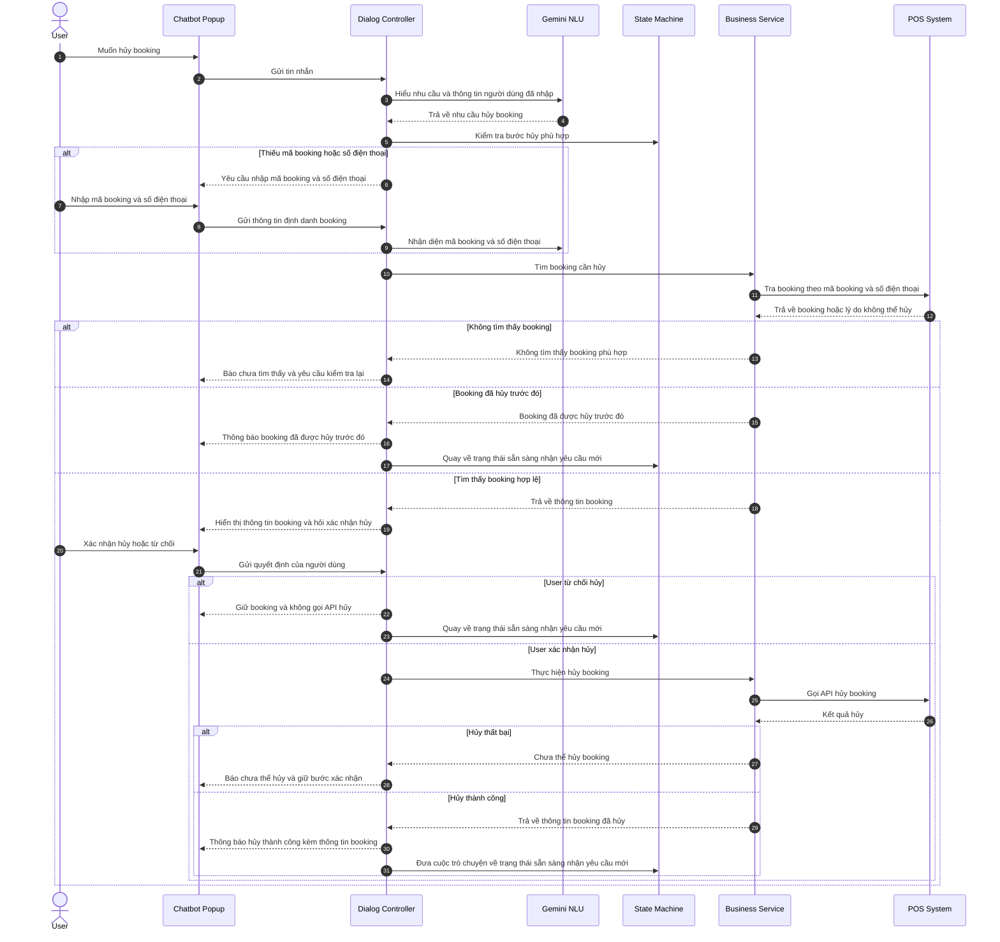
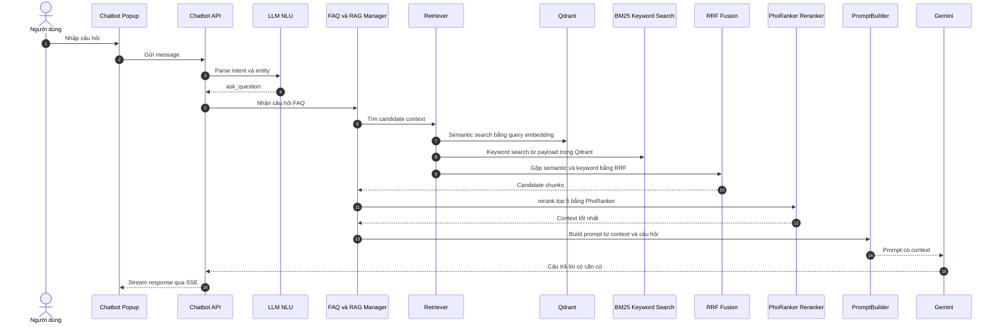
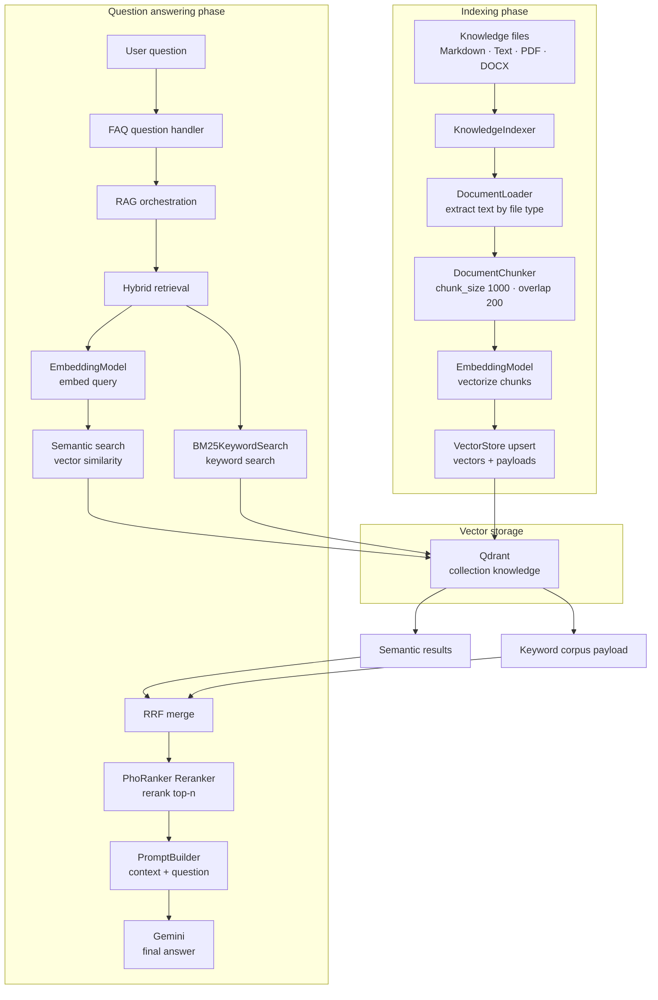

<h1 align="center">Booking AI Chatbot</h1>

  Trợ lý hội thoại tiếng Việt cho đặt lịch wellness, FAQ và trả lời dựa trên tri thức nội bộ bằng RAG.

  
  
  
  

  <a href="#tổng-quan">Tổng quan</a> ·
  <a href="#điểm-nổi-bật">Điểm nổi bật</a> ·
  <a href="#architecture">Architecture</a> ·
  <a href="#luồng-chatbot">Luồng chatbot</a> ·
  <a href="#rag-hoạt-động-như-thế-nào">RAG hoạt động như thế nào</a> ·
  <a href="#cấu-hình-chính">Cấu hình chính</a>

Booking AI Chatbot là service chatbot dùng trong popup trên website Komorebi. Hệ thống kết hợp Gemini cho NLU và NLG, state machine cho luồng đặt lịch, POS API cho dữ liệu nghiệp vụ và Qdrant cho truy xuất tri thức nội bộ.

---

## Tổng Quan

LLM có thể hiểu và diễn đạt tự nhiên, nhưng các dữ liệu như cửa hàng, liệu trình, slot trống, kỹ thuật viên, khách hàng và booking phải đến từ hệ thống nghiệp vụ thật. Vì vậy chatbot được thiết kế theo hướng:

1. Gemini chỉ đọc raw text để nhận diện intent và extract entity.
2. Backend deterministic xử lý state, validate dữ liệu và gọi POS cùng Qdrant.
3. POS là nguồn dữ liệu chính xác cho booking.
4. Qdrant là nguồn truy xuất knowledge cho các câu hỏi FAQ và RAG.
5. Response cuối có thể được Gemini diễn đạt lại nhưng không được phá business flow.

## Điểm Nổi Bật

Khả năng | Chi tiết
--- | ---
Hội thoại có trạng thái | `BookingContext` lưu thông tin đã xác nhận qua nhiều lượt chat
NLU bằng Gemini | Gemini function calling extract intent và entity, sau đó Pydantic validate contract
Business flow rõ ràng | `StateMachine` và `booking_flow.json` điều phối từng bước đặt lịch
POS authoritative | Shop, course, slot, therapist, customer và booking transaction đều kiểm tra qua POS
RAG knowledge retrieval | FAQ và thông tin tư vấn được retrieve từ Qdrant trước khi Gemini trả lời
SSE response | Hỗ trợ stream response về frontend popup qua Server-Sent Events

## Architecture

```mermaid
flowchart TD
    U[User] --> FE[Next.js Frontend]
    FE --> API[FastAPI Chat API]

    API --> CTX[Conversation Context]
    CTX --> NLU[LLM NLU]

    NLU --> FC[Function Calling]
    FC --> VAL[Schema Validation]
    VAL --> IP[Intent Prioritizer]

    IP --> ER{Need Entity Resolution?}

    ER -- Yes --> RES[Entity Resolution]
    ER -- No --> SM[State Machine]
    RES --> SM

    SM --> ACTION[Action Processing]

    ACTION --> POS[POS Client]
    POS --> POSBE[POS Backend]

    ACTION --> KB[Knowledge và FAQ]
    KB --> QD[Qdrant]

    POSBE --> RESULT[Outcome + Data]
    QD --> RESULT
    ACTION --> RESULT

    RESULT --> CTXUP[Update Booking Context]
    CTXUP --> TRANS[State Transition]

    TRANS --> INST[Instruction Builder]
    INST --> NLG[LLM NLG]

    NLG --> SAVE[Save Conversation Context]
    SAVE --> RESP[SSE và JSON Response]
    RESP --> FE
```

Các nguyên tắc kiến trúc hiện tại:

1. Raw user text được đọc bởi class `LLMNLU`.
2. Backend deterministic chỉ xử lý structured output sau NLU.
3. `BookingContext` chỉ được commit sau khi business pipeline hoàn tất.
4. POS là nguồn dữ liệu nghiệp vụ authoritative cho catalog, availability và booking transaction.
5. Qdrant chỉ đi qua nhánh FAQ và RAG, không chạy cho mọi request.

## Luồng Chatbot

Phần này mô tả các flow hội thoại chính theo `booking_flow.json`: chatbot luôn bắt đầu ở `idle`, dùng Gemini để hiểu ý người dùng, sau đó state machine điều phối sang đặt lịch, hủy lịch hoặc hỏi lại khi chưa đủ thông tin.

### Luồng Tổng Thể

```mermaid
flowchart TD
    subgraph CLIENT["Client Layer"]
        USER[Người dùng]
        POPUP[Chatbot Popup]
    end

    subgraph CHATBOT["Chatbot Backend"]
        API[Chat API]
        CONTEXT[Conversation Context]
        NLU[Gemini NLU]
        ROUTER[Intent Routing]
        FLOW[State Machine]
        ACTION[Business Action]
        RESPONSE[Response Builder]
        NLG[Gemini NLG]
    end

    subgraph EXTERNAL["External Systems"]
        POS[POS API]
        QDRANT[Qdrant Knowledge Base]
    end

    USER -->|Nhập tin nhắn| POPUP
    POPUP -->|Gửi request| API
    API -->|Tải ngữ cảnh hội thoại| CONTEXT
    API -->|Gửi text và context| NLU
    NLU -->|Trả về nhu cầu và thông tin đã nhận diện| ROUTER
    ROUTER -->|Kiểm tra bước hội thoại phù hợp| FLOW
    FLOW -->|Điều phối thao tác cần chạy| ACTION

    ACTION -->|Đặt lịch, hủy lịch, kiểm tra slot, kiểm tra khách hàng| POS
    ACTION -->|Tra cứu FAQ và tri thức nội bộ| QDRANT
    POS -->|Dữ liệu nghiệp vụ| ACTION
    QDRANT -->|Context liên quan| ACTION

    ACTION -->|Kết quả xử lý| RESPONSE
    RESPONSE -->|Tạo câu trả lời tự nhiên khi cần| NLG
    NLG -->|Nội dung trả lời cuối cùng| RESPONSE
    RESPONSE -->|Lưu lại trạng thái mới| CONTEXT
    RESPONSE -->|Stream hoặc trả JSON| POPUP
    POPUP -->|Hiển thị câu trả lời| USER
```

Điểm quan trọng:

1. Client chỉ gửi tin nhắn và hiển thị kết quả, không quyết định nghiệp vụ.
2. Gemini NLU hiểu nhu cầu người dùng, còn State Machine quyết định bước hội thoại hợp lệ.
3. Business Action là nơi gọi POS hoặc Qdrant tùy theo nhu cầu đặt lịch, hủy lịch hoặc hỏi thông tin.
4. Conversation Context được tải đầu lượt và lưu lại cuối lượt để giữ mạch hội thoại nhiều turn.
5. Response Builder và Gemini NLG tạo câu trả lời cuối cùng trước khi stream về popup.

### Luồng Đặt Booking

```mermaid
sequenceDiagram
    autonumber
    actor User as User
    participant Popup as Chatbot Popup
    participant Bot as Dialog Controller
    participant AI as Gemini NLU
    participant Flow as State Machine
    participant Service as Business Service
    participant POS as POS System

    User->>Popup: Muốn đặt lịch
    Popup->>Bot: Gửi tin nhắn
    Bot->>AI: Hiểu nhu cầu và thông tin người dùng đã nhập
    AI-->>Bot: Trả về nhu cầu đặt lịch cùng dữ liệu đã nhận diện
    Bot->>Flow: Kiểm tra bước phù hợp trong hội thoại
    Flow-->>Bot: Chuyển sang bước chọn cửa hàng
    Bot->>Service: Yêu cầu danh sách cửa hàng
    Service->>POS: Lấy danh sách cửa hàng đang hoạt động
    POS-->>Service: Trả về danh sách cửa hàng
    Service-->>Bot: Chuẩn bị danh sách gợi ý
    Bot-->>Popup: Hỏi anh/chị muốn chọn cửa hàng nào

    User->>Popup: Chọn cửa hàng, ngày, số người, thời lượng và liệu trình
    Popup->>Bot: Gửi từng lượt hoặc một câu dài
    Bot->>AI: Hiểu các thông tin đặt lịch trong câu trả lời
    Bot->>Flow: Kiểm tra thông tin có đúng bước hiện tại không
    Bot->>Service: Xác thực dữ liệu nghiệp vụ
    Service->>POS: Kiểm tra cửa hàng, thời lượng và liệu trình khi cần
    POS-->>Service: Trả về dữ liệu hợp lệ hoặc lý do chưa hợp lệ

    User->>Popup: Chọn add-on hoặc bỏ qua
    Popup->>Bot: Gửi lựa chọn add-on
    Bot->>Service: Ghi nhận add-on hoặc bỏ qua add-on
    Service->>POS: Kiểm tra slot trống theo toàn bộ thông tin đặt lịch
    POS-->>Service: Trả về danh sách slot hoặc lý do không có slot

    alt Không có slot phù hợp
        Service-->>Bot: Ngày hoặc tiêu chí hiện tại chưa có slot phù hợp
        Bot-->>Popup: Đề nghị đổi ngày, giờ, dịch vụ hoặc cửa hàng
    else Có slot phù hợp
        Bot-->>Popup: Hỏi giờ bắt đầu
        User->>Popup: Chọn giờ bắt đầu
        Popup->>Bot: Gửi giờ đã chọn
        Bot->>Service: Kiểm tra lại slot đã chọn
        Service->>POS: Xác thực slot theo giờ bắt đầu
        POS-->>Service: Slot hợp lệ
    end

    alt Booking một người
        Bot-->>Popup: Hỏi kỹ thuật viên hoặc không yêu cầu
        User->>Popup: Chọn kỹ thuật viên, giới tính hoặc không yêu cầu
        Popup->>Bot: Gửi lựa chọn kỹ thuật viên
        Bot->>Service: Ghi nhận hoặc kiểm tra yêu cầu kỹ thuật viên
        Service->>POS: Kiểm tra lịch làm việc kỹ thuật viên nếu có yêu cầu
        POS-->>Service: Kỹ thuật viên hợp lệ
    else Booking hai đến ba người
        Bot->>Service: Bỏ qua chọn kỹ thuật viên theo quy định booking nhóm
    end

    Bot-->>Popup: Hỏi số điện thoại
    User->>Popup: Nhập số điện thoại
    Popup->>Bot: Gửi số điện thoại
    Bot->>Service: Kiểm tra thông tin khách hàng
    Service->>POS: Tra khách hàng và danh sách hạn chế
    POS-->>Service: Khách hàng hợp lệ hoặc cần bổ sung tên

    alt Chưa có tên khách hàng
        Bot-->>Popup: Hỏi tên khách hàng
        User->>Popup: Nhập tên
        Popup->>Bot: Gửi tên khách hàng
        Bot->>Service: Lưu tên vào thông tin đặt lịch
    end

    Bot-->>Popup: Hiển thị form xác nhận
    User->>Popup: Xác nhận
    Popup->>Bot: Gửi xác nhận cuối cùng
    Bot->>Service: Tạo booking chính thức
    Service->>POS: Kiểm tra availability lần cuối
    POS-->>Service: Slot vẫn còn hợp lệ
    Service->>POS: Tạo booking với mã chống gửi trùng
    POS-->>Service: Booking được tạo thành công
    Bot-->>Popup: Thông báo đặt lịch thành công
    Bot->>Flow: Đưa cuộc trò chuyện về trạng thái sẵn sàng nhận yêu cầu mới
```

Business rule chính:

1. Slot chỉ được xem là hợp lệ sau khi có đủ cửa hàng, ngày, số người, thời lượng, liệu trình chính và add-on nếu có.
2. Booking hai đến ba người không chọn kỹ thuật viên cá nhân.
3. Trước khi tạo booking thật, hệ thống luôn check lại availability lần cuối để tránh giữ slot đã bị người khác đặt.
4. Sau khi đặt thành công, task context được reset về `idle` để người dùng có thể tiếp tục đặt hoặc hủy booking khác trong cùng session.

### Luồng Hủy Booking

```mermaid
sequenceDiagram
    autonumber
    actor User as User
    participant Popup as Chatbot Popup
    participant Bot as Dialog Controller
    participant AI as Gemini NLU
    participant Flow as State Machine
    participant Service as Business Service
    participant POS as POS System

    User->>Popup: Muốn hủy booking
    Popup->>Bot: Gửi tin nhắn
    Bot->>AI: Hiểu nhu cầu và thông tin người dùng đã nhập
    AI-->>Bot: Trả về nhu cầu hủy booking
    Bot->>Flow: Kiểm tra bước hủy phù hợp

    alt Thiếu mã booking hoặc số điện thoại
        Bot-->>Popup: Yêu cầu nhập mã booking và số điện thoại
        User->>Popup: Nhập mã booking và số điện thoại
        Popup->>Bot: Gửi thông tin định danh booking
        Bot->>AI: Nhận diện mã booking và số điện thoại
    end

    Bot->>Service: Tìm booking cần hủy
    Service->>POS: Tra booking theo mã booking và số điện thoại
    POS-->>Service: Trả về booking hoặc lý do không thể hủy

    alt Không tìm thấy booking
        Service-->>Bot: Không tìm thấy booking phù hợp
        Bot-->>Popup: Báo chưa tìm thấy và yêu cầu kiểm tra lại
    else Booking đã hủy trước đó
        Service-->>Bot: Booking đã được hủy trước đó
        Bot-->>Popup: Thông báo booking đã được hủy trước đó
        Bot->>Flow: Quay về trạng thái sẵn sàng nhận yêu cầu mới
    else Tìm thấy booking hợp lệ
        Service-->>Bot: Trả về thông tin booking
        Bot-->>Popup: Hiển thị thông tin booking và hỏi xác nhận hủy
        User->>Popup: Xác nhận hủy hoặc từ chối
        Popup->>Bot: Gửi quyết định của người dùng

        alt User từ chối hủy
            Bot-->>Popup: Giữ booking và không gọi API hủy
            Bot->>Flow: Quay về trạng thái sẵn sàng nhận yêu cầu mới
        else User xác nhận hủy
            Bot->>Service: Thực hiện hủy booking
            Service->>POS: Gọi API hủy booking
            POS-->>Service: Kết quả hủy

            alt Hủy thất bại
                Service-->>Bot: Chưa thể hủy booking
                Bot-->>Popup: Báo chưa thể hủy và giữ bước xác nhận
            else Hủy thành công
                Service-->>Bot: Trả về thông tin booking đã hủy
                Bot-->>Popup: Thông báo hủy thành công kèm thông tin booking
                Bot->>Flow: Đưa cuộc trò chuyện về trạng thái sẵn sàng nhận yêu cầu mới
            end
        end
    end
```

Business rule chính:

1. Chatbot không hủy booking ngay khi người dùng chỉ nói muốn hủy.
2. Hệ thống bắt buộc kiểm tra bằng mã booking và số điện thoại đặt lịch.
3. Khi tìm thấy booking, chatbot phải hiển thị thông tin để người dùng xác nhận trước.
4. Chỉ khi người dùng xác nhận, hệ thống mới gọi POS API để hủy booking.
5. Sau khi hủy thành công hoặc từ chối hủy, session quay lại `idle` để nhận yêu cầu mới.

## RAG Hoạt Động Như Thế Nào

RAG bổ sung một pipeline truy xuất tri thức trước khi Gemini sinh câu trả lời. Trong project hiện tại, `rag_v1` không chỉ dùng vector search mà còn kết hợp semantic search, BM25 keyword search, RRF fusion và reranker để chọn context tốt hơn.

### Giai Đoạn Query

Chạy cho mỗi câu hỏi thông tin từ người dùng.

```mermaid
sequenceDiagram
    autonumber
    actor User as Người dùng
    participant Popup as Chatbot Popup
    participant API as Chatbot API
    participant NLU as LLM NLU
    participant RAG as FAQ và RAG Manager
    participant Retriever as Retriever
    participant Qdrant as Qdrant
    participant BM25 as BM25 Keyword Search
    participant Fusion as RRF Fusion
    participant Reranker as PhoRanker Reranker
    participant Prompt as PromptBuilder
    participant Gemini as Gemini

    User->>Popup: Nhập câu hỏi
    Popup->>API: Gửi message
    API->>NLU: Parse intent và entity
    NLU-->>API: ask_question
    API->>RAG: Nhận câu hỏi FAQ
    RAG->>Retriever: Tìm candidate context
    Retriever->>Qdrant: Semantic search bằng query embedding
    Retriever->>BM25: Keyword search từ payload trong Qdrant
    Retriever->>Fusion: Gộp semantic và keyword bằng RRF
    Fusion-->>RAG: Candidate chunks
    RAG->>Reranker: rerank top 5 bằng PhoRanker
    Reranker-->>RAG: Context tốt nhất
    RAG->>Prompt: Build prompt từ context và câu hỏi
    Prompt-->>Gemini: Prompt có context
    Gemini-->>API: Câu trả lời có căn cứ
    API-->>Popup: Stream response qua SSE
```

Nguyên tắc vận hành:

1. RAG chỉ xử lý câu hỏi thông tin, không thay thế booking flow.
2. Semantic search giúp tìm nội dung gần nghĩa với câu hỏi.
3. BM25 giúp bắt các cụm từ khóa cụ thể mà vector search có thể bỏ sót.
4. RRF fusion gộp hai nguồn kết quả để tạo danh sách candidate cân bằng hơn.
5. PhoRanker reranker chấm lại candidate bằng cặp `query + chunk text` để chọn context cuối cùng.
6. Gemini chỉ nên trả lời dựa trên context đã retrieve và rerank.
7. Nếu không tìm thấy dữ liệu phù hợp, chatbot cần nói rõ chưa có thông tin trong knowledge base.
8. Các thao tác đặt lịch, hủy lịch, validate slot và kiểm tra khách hàng luôn đi qua POS API.

### Pipeline RAG Nội Bộ

```mermaid
flowchart TD
    subgraph INDEXING["Indexing phase"]
        DOC["Knowledge files<br>Markdown · Text · PDF · DOCX"]
        INDEXER["KnowledgeIndexer"]
        LOADER["DocumentLoader<br>extract text by file type"]
        CHUNKER["DocumentChunker<br>chunk_size 1000 · overlap 200"]
        EMBED_DOC["EmbeddingModel<br>vectorize chunks"]
        UPSERT["VectorStore upsert<br>vectors + payloads"]
    end

    subgraph STORAGE["Vector storage"]
        QDRANT["Qdrant<br>collection knowledge"]
    end

    subgraph QUERYING["Question answering phase"]
        USER_Q["User question"]
        FAQ["FAQ question handler"]
        SERVICE["RAG orchestration"]
        RETRIEVER["Hybrid retrieval"]
        EMBED_Q["EmbeddingModel<br>embed query"]
        SEMANTIC["Semantic search<br>vector similarity"]
        KEYWORD["BM25KeywordSearch<br>keyword search"]
        RRF["RRF merge"]
        RERANK["PhoRanker Reranker<br>rerank top-n"]
        PROMPT["PromptBuilder<br>context + question"]
        GEMINI["Gemini<br>final answer"]
    end

    DOC --> INDEXER
    INDEXER --> LOADER
    LOADER --> CHUNKER
    CHUNKER --> EMBED_DOC
    EMBED_DOC --> UPSERT
    UPSERT --> QDRANT

    USER_Q --> FAQ
    FAQ --> SERVICE
    SERVICE --> RETRIEVER
    RETRIEVER --> EMBED_Q
    EMBED_Q --> SEMANTIC
    SEMANTIC --> QDRANT
    RETRIEVER --> KEYWORD
    KEYWORD --> QDRANT
    QDRANT --> SEMANTIC_RESULT["Semantic results"]
    QDRANT --> KEYWORD_RESULT["Keyword corpus payload"]
    SEMANTIC_RESULT --> RRF
    KEYWORD_RESULT --> RRF
    RRF --> RERANK
    RERANK --> PROMPT
    PROMPT --> GEMINI
```

Điểm đáng chú ý:

1. `KnowledgeIndexer` điều phối luồng index nhưng không tự parse file, chunk, embed hoặc gọi Qdrant trực tiếp.
2. `DocumentLoader` load Markdown, text, PDF và DOCX thành `Document`.
3. `DocumentChunker` chia `Document` thành `Chunk` có overlap để giữ ngữ cảnh.
4. `EmbeddingModel` dùng chung cho cả embedding chunk lúc index và embedding query lúc hỏi.
5. `Retriever` lấy candidate bằng semantic search trong Qdrant và keyword search bằng BM25.
6. `RRF` gộp kết quả semantic với keyword trước khi đưa qua `PhoRanker`.
7. `PromptBuilder` đóng gói context theo format `[Context n]`, kèm source và chunk index.

### Trách Nhiệm Chính

Thành phần | Trách nhiệm
--- | ---
Knowledge files | Chứa nội dung tư vấn, chính sách, FAQ hoặc mô tả dịch vụ
KnowledgeIndexer | Điều phối loader, chunker, embedder và vector store khi index knowledge
DocumentLoader | Extract text từ Markdown, text, PDF và DOCX
DocumentChunker | Chia tài liệu thành chunk có overlap để giữ ngữ cảnh
EmbeddingModel | Tạo vector bằng Sentence Transformers
VectorStore | Lưu vector và payload vào Qdrant, đồng thời search semantic bằng cosine similarity
BM25KeywordSearch | Search theo từ khóa dựa trên payload text trong Qdrant
Retriever | Gộp semantic search và keyword search bằng RRF
Reranker | Dùng PhoRanker để chọn context liên quan nhất
PromptBuilder | Build prompt có context, source, chunk index và câu hỏi
FAQManager | Wrap kết quả RAG thành response đúng contract chatbot
Gemini | Sinh câu trả lời tự nhiên dựa trên context đã retrieve
Chatbot Popup | Hiển thị hội thoại và nhận response stream từ backend

### Khi Nào Cần Re-index

Chạy lại indexing khi:

1. Thêm tài liệu knowledge mới.
2. Cập nhật nội dung dịch vụ, chính sách hoặc FAQ.
3. Bổ sung file PDF và Markdown mới.
4. Thay đổi chunking, embedding model hoặc collection Qdrant.

## Cấu Hình Chính

Biến | Mục đích
--- | ---
`BOOKING_API_URL` | Base URL của POS backend
`GEMINI_API_KEY` | API key dùng cho Gemini NLU và NLG
`GEMINI_BASE_URL` | Endpoint OpenAI-compatible của Gemini
`GEMINI_MODEL` | Model Gemini chính
`GEMINI_FALLBACK_MODEL` | Model fallback khi retry
`LLM_MAX_RETRIES` | Số lần retry ở LLM gateway
`BUSINESS_TIMEZONE` | Múi giờ nghiệp vụ dùng cho relative dates
`KNOWLEDGE_QDRANT_ENABLED` | Bật hoặc tắt FAQ và RAG retrieval qua Qdrant
`QDRANT_HOST` | Host Qdrant
`QDRANT_PORT` | Port Qdrant
`QDRANT_API_KEY` | API key Qdrant nếu có
`QDRANT_COLLECTION` | Collection knowledge base
`LOG_LEVEL` | Mức log backend
`LOG_FORMAT` | Định dạng log, ví dụ `console` hoặc `json`
`APP_ENV` | Môi trường chạy app
