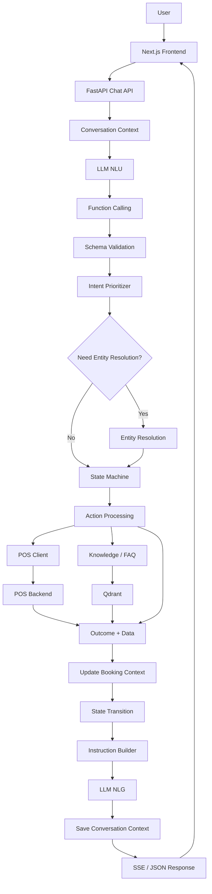

# Booking AI Chatbot

## Overview

Booking AI Chatbot là trợ lý hội thoại tiếng Việt cho luồng đặt lịch wellness. Hệ thống được xây dựng theo kiến trúc hội thoại có trạng thái, trong đó `LLMNLU` là thành phần duy nhất đọc raw user text để nhận diện intent và trích xuất entity. Backend deterministic chỉ xử lý structured semantics sau NLU, điều phối flow qua `StateMachine`, chạy action qua `ActionRegistry`, gọi POS khi cần và trả response về frontend qua JSON hoặc SSE.

## Features

- Hỗ trợ hội thoại đặt lịch nhiều turn với `BookingContext`.
- LLM-based NLU bằng Gemini + function calling + Pydantic validation.
- Intent prioritization theo state và context thay vì dispatch trực tiếp từ raw output.
- Entity resolution authoritative qua handler/POS, không dùng deterministic NLU bằng keyword.
- Tích hợp POS cho shop, course, availability, therapist, customer verification và create booking.
- Tích hợp FAQ / knowledge retrieval qua Qdrant theo nhánh `ask_question`.
- Hỗ trợ trả response qua JSON và SSE dùng chung business pipeline.

## Architecture


```mermaid
flowchart TD
    U[User] --> FE[Next.js Frontend]
    FE --> API[FastAPI Chat API]

    API --> CTX[Conversation Context]
    CTX --> NLU[LLM NLU]

    NLU --> FC[Function Calling]
    FC --> VAL[Schema Validation]
    VAL --> IP[Intent Prioritizer]

    IP --> ER{Need Entity Resolution?}

    ER -- Yes --> RES[Entity Resolution]
    ER -- No --> SM[State Machine]
    RES --> SM

    SM --> ACTION[Action Processing]

    ACTION --> POS[POS Client]
    POS --> POSBE[POS Backend]

    ACTION --> KB[Knowledge / FAQ]
    KB --> QD[Qdrant]

    POSBE --> RESULT[Outcome + Data]
    QD --> RESULT
    ACTION --> RESULT

    RESULT --> CTXUP[Update Booking Context]
    CTXUP --> TRANS[State Transition]

    TRANS --> INST[Instruction Builder]
    INST --> NLG[LLM NLG]

    NLG --> SAVE[Save Conversation Context]
    SAVE --> RESP[SSE / JSON Response]
    RESP --> FE
```

Các nguyên tắc kiến trúc hiện tại:

- Raw user text được đọc bởi `backend/app/dialog/nlu.py::LLMNLU`.
- Backend deterministic chỉ xử lý structured output sau NLU.
- `BookingContext` chỉ được commit sau khi business pipeline hoàn tất.
- POS là nguồn dữ liệu nghiệp vụ authoritative cho catalog, availability và booking transaction.
- Qdrant chỉ đi qua nhánh FAQ/RAG, không chạy cho mọi request.

## Tech Stack

- Frontend: Next.js
- Backend API: FastAPI
- LLM: Gemini qua `LLMGateway`
- NLU contract: function calling + Pydantic validation
- Dialog orchestration: `DialogController`, `StateMachine`, `ActionRegistry`
- POS integration: `PosApiClient`
- Knowledge retrieval: Qdrant qua `KnowledgeQdrantClient`
- Streaming delivery: SSE

## Conversation Flow

Flow end-to-end hiện tại:

```text
User
-> frontend UI
-> frontend route /api/chat hoặc /api/chat/stream
-> backend /api/v1/chat hoặc /api/v1/chat/stream
-> DialogController.handle_message(...)
-> ConversationContextStore.get_copy(conversation_id)
-> LLMNLU.parse(text, state, context)
-> Gemini function calling
-> Pydantic validation
-> IntentPrioritizer.choose(...)
-> nếu cần thì EntityResolutionCoordinator.resolve(...)
-> StateMachine.resolve_transition(...)
-> ActionRegistry.execute_actions(...)
-> handler / PosApiClient / FAQManager
-> HandlerResult / DialogTurnResult
-> StateMachine.apply_transition(...)
-> InstructionBuilder
-> ResponseGenerator.generate(...)
-> ConversationContextStore.save(...)
-> JSON response hoặc SSE events
-> frontend hiển thị cho user
```

### Core Components

#### Transport

`backend/app/transport/chat_api.py`

- Nhận `ChatRequest`
- Lấy `ApplicationContainer`
- Gọi `DialogController.handle_message(...)`
- Map `DialogResponse` sang `ChatResponse`
- Với SSE thì dùng `backend/app/transport/sse.py::stream_chat_events`

#### NLU

`backend/app/dialog/nlu.py::LLMNLU`

Flow của NLU:

```text
User text
-> Gemini function calling
-> Pydantic validation
-> IntentPrioritizer
-> NLUResult
```

`IntentPrioritizer` nằm trong NLU layer để chọn candidate phù hợp với state hiện tại. `StateIntentPolicy` được dùng để giới hạn intent hợp lệ theo `booking_flow.json`.

#### State Machine và Action Processing

- `backend/app/dialog/state_machine.py::StateMachine`
- `backend/app/application/action_registry.py::ActionRegistry`

Trình tự runtime chính:

```text
NLUResult
-> StateMachine.resolve_transition(...)
-> ActionRegistry.execute_actions(...)
-> StateMachine.apply_transition(...)
-> auto transition nếu đủ điều kiện
```

`ActionRegistry` là dispatcher thật của action name trong flow JSON. Một số action gọi handler class thực sự như `SearchShopHandler`, `CheckAvailabilityHandler`, `CheckCustomerHandler`, `CreateBookingHandler`; một số action cập nhật `BookingContext` trực tiếp qua domain methods.

#### Entity Resolution

`backend/app/dialog/nlu.py::EntityResolutionCoordinator`

Nhánh này chỉ chạy khi `NLUResult.resolution_status == ENTITY_RESOLUTION_REQUIRED`.

```text
NLUResult
-> EntityResolutionCoordinator.resolve(...)
-> SearchShopHandler / SearchCourseHandler / therapist lookup
-> entity_resolution_to_dialog_turn_input(...)
-> DialogController.handle_turn(...)
```

Entity resolution dùng dữ liệu authoritative từ handler/POS thay vì suy đoán bằng keyword.

#### Booking Context

`backend/app/domain/booking_context.py::BookingContext`

`BookingContext` giữ dữ liệu đã tích lũy qua nhiều turn, ví dụ:

```json
{
  "booking_date": "2026-08-10",
  "num_customer": 1,
  "duration_minutes": 60,
  "main_course_name": "Aroma Massage",
  "addons": ["Head Massage"],
  "start_time": "08:00"
}
```

Phân biệt rõ:

- NLU entities: dữ liệu extract từ message hiện tại
- `requested_*` fields: dữ liệu tạm stage để hệ thống tiêu thụ theo đúng state
- validated booking fields: dữ liệu đã được application/domain/POS chấp nhận

#### POS Integration

Boundary hiện tại:

```text
Chatbot handler/action
-> PosApiClient
-> POS backend
```

POS adapter thực tế:

- `backend/app/infrastructure/pos_api_client.py::PosApiClient`

Các nghiệp vụ chính đang có trong code:

- lấy shop
- tìm course theo shop
- kiểm tra available slots
- tìm therapist available
- kiểm tra customer / phone / blacklist
- tạo booking

#### RAG / FAQ Integration

Qdrant không chạy trên mọi request.

Nhánh RAG thực tế:

```text
ask_question
-> FAQManager.answer(...)
-> KnowledgeGateway.search(...)
-> KnowledgeQdrantClient.search(...)
-> InstructionBuilder.build_faq_response(...)
```

Các class liên quan:

- `backend/app/infrastructure/qdrant_client.py::FAQManager`
- `backend/app/infrastructure/qdrant_client.py::KnowledgeQdrantClient`

#### Response Generation

Pipeline response hiện tại:

```text
DialogTurnResult
-> InstructionBuilder
-> DialogResponse
-> nếu llm_nlg_required=true:
   ResponseGenerator.generate(...)
-> ChatResponse hoặc SSE event
```

`InstructionBuilder` và `ResponseGenerator` chỉ làm response generation, không quyết định business flow.

#### SSE và Frontend Delivery

Backend:

- JSON endpoint: `POST /api/v1/chat`
- SSE endpoint: `POST /api/v1/chat/stream`
- SSE event lifecycle: `started -> message -> completed`

Frontend:

- `frontend/app/api/chat/route.ts` proxy JSON sang backend
- `frontend/app/api/chat/stream/route.ts` proxy SSE sang backend
- `frontend/services/chat-api.ts` parse JSON hoặc SSE event để cập nhật UI

### End-to-End Example

Ví dụ ngắn cho flow thêm add-on:

```text
User:
"Tôi muốn thêm Head Massage"

Current state:
selecting_service

LLMNLU:
intent=select_course
entities.service_name="Head Massage"

IntentPrioritizer:
chọn select_course vì hợp state hiện tại

EntityResolutionCoordinator:
resolve "Head Massage" trong shop hiện tại

DialogController + ActionRegistry:
dispatch action handle_course_selection

BookingContext:
main_course giữ nguyên
addons cập nhật thêm "Head Massage" nếu hợp lệ

StateMachine:
transition theo flow hiện tại

InstructionBuilder:
build response draft cho state tiếp theo

ResponseGenerator:
diễn đạt lại thành câu trả lời tự nhiên
```

## Project Structure

```text
booking-ai-chatbot/
├── backend/
│   ├── app/
│   │   ├── application/
│   │   │   ├── action_registry.py
│   │   │   └── handlers/
│   │   ├── dialog/
│   │   │   ├── booking_flow.json
│   │   │   ├── dialog_controller.py
│   │   │   ├── instruction_builder.py
│   │   │   ├── intent_prioritizer.py
│   │   │   ├── nlu.py
│   │   │   ├── response_generator.py
│   │   │   └── state_machine.py
│   │   ├── domain/
│   │   │   ├── booking_context.py
│   │   │   ├── booking_models.py
│   │   │   ├── booking_state.py
│   │   │   └── outcomes.py
│   │   ├── infrastructure/
│   │   │   ├── context_store.py
│   │   │   ├── gemini_client.py
│   │   │   ├── pos_api_client.py
│   │   │   └── qdrant_client.py
│   │   ├── transport/
│   │   │   ├── chat_api.py
│   │   │   ├── schemas.py
│   │   │   └── sse.py
│   │   ├── dependencies.py
│   │   └── main.py
│   └── tests/
└── frontend/
    ├── app/api/chat/
    ├── services/chat-api.ts
    └── types/chat.ts
```

## Setup & Run

### API

#### `POST /api/v1/chat`

Request:

```json
{
  "conversation_id": "web-7f63d2",
  "message": "Tôi muốn đặt lịch",
  "idempotency_key": "optional-client-key"
}
```

Response:

```json
{
  "conversation_id": "web-7f63d2",
  "text": "Bạn muốn đặt lịch tại cửa hàng nào?",
  "state": "selecting_shop",
  "status": "success",
  "instruction_template": "ask_shop",
  "quick_replies": [],
  "metadata": {}
}
```

#### `POST /api/v1/chat/stream`

Dùng cùng request schema và trả các event:

```text
started -> message -> completed
```

### Backend

```powershell
cd D:\Intern_Fsoft\booking-ai-system\booking-ai-chatbot\backend
python -m venv .venv
.\.venv\Scripts\Activate.ps1
python -m pip install -e ".[dev]"
Copy-Item .env.example .env
python -m uvicorn app.main:app --host 127.0.0.1 --port 8001 --reload
```

### Frontend

```powershell
cd D:\Intern_Fsoft\booking-ai-system\booking-ai-chatbot\frontend
npm install
Copy-Item .env.example .env.local
npm run dev
```

## Environment Variables

Các biến runtime chính cần chú ý:

- `BOOKING_API_URL`: base URL của POS backend
- `GEMINI_API_KEY`: API key cho Gemini
- `GEMINI_BASE_URL`: endpoint OpenAI-compatible của Gemini
- `GEMINI_MODEL`: model Gemini chính cho NLU/NLG
- `GEMINI_FALLBACK_MODEL`: model fallback khi cấu hình retry
- `LLM_MAX_RETRIES`: số lần retry ở LLM gateway
- `BUSINESS_TIMEZONE`: múi giờ nghiệp vụ dùng cho relative dates
- `KNOWLEDGE_QDRANT_ENABLED`: bật/tắt FAQ retrieval qua Qdrant
- `QDRANT_HOST`: host Qdrant
- `QDRANT_PORT`: port Qdrant
- `QDRANT_API_KEY`: API key Qdrant nếu có
- `QDRANT_COLLECTION`: collection knowledge base
- `LOG_LEVEL`: mức log backend
- `LOG_FORMAT`: format log, ví dụ `console` hoặc `json`
- `APP_ENV`: môi trường chạy app, ảnh hưởng một số debug logs
