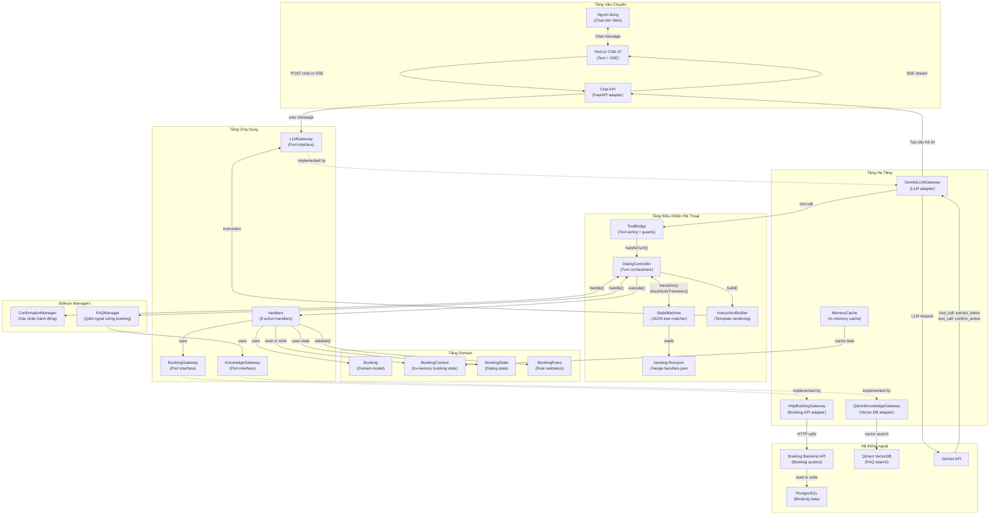

# Booking AI Chatbot

Chatbot hỗ trợ khách hàng tìm hiểu dịch vụ và thực hiện các thao tác đặt, tra cứu,
đổi hoặc hủy lịch massage thông qua Booking Backend.

Repository hiện đang ở giai đoạn **thiết kế skeleton Clean Architecture**. Backend
chatbot mới chỉ có cấu trúc thư mục và module docstring, chưa triển khai business
logic hoặc tích hợp dịch vụ thật.

## Trạng thái hiện tại

Đã hoàn thành:

- Cấu trúc package theo Clean Architecture.
- Ranh giới giữa transport, dialog, application, domain và infrastructure.
- Vị trí dành cho các application port.
- Vị trí dành cho adapter Gemini, Booking API và Qdrant.
- Skeleton unit test và integration test.
- `BookingContext` được thiết kế để lưu trạng thái tạm thời trong process memory.

Chưa triển khai:

- FastAPI router và SSE runtime.
- Dialog controller và state machine.
- Application handler.
- `BookingGateway`, `KnowledgeGateway` và `LLMGateway`.
- Gemini, Qdrant và HTTP Booking API adapter.
- Booking flow và change handler.
- RAG, tool calling và confirmation workflow.
- Business rule và test logic.

Backend hiện tại **chưa thể chạy** bằng Uvicorn. Việc triển khai logic chỉ bắt đầu
sau khi cấu trúc được xác nhận.

## Mục tiêu kiến trúc

Kiến trúc được thiết kế để:

- Thay FastAPI bằng Django hoặc framework khác mà không sửa business logic.
- Thay Gemini bằng provider khác mà không sửa application logic.
- Thay Qdrant bằng Milvus mà không sửa FAQ logic.
- Thay HTTP Booking API bằng gRPC hoặc mock mà không sửa handler.
- Giữ domain độc lập với framework, SDK và cơ sở dữ liệu.
- Đảm bảo dependency luôn hướng từ tầng ngoài vào tầng trong.

## Sơ đồ kiến trúc dự kiến


```mermaid
flowchart TB
  subgraph Transport["Tầng Vận Chuyển"]
    User["Người dùng\n(Chat trên Web)"]
    FE["Next.js Chat UI\n(Text + SSE)"]
    API["Chat API\n(FastAPI adapter)"]
  end
 
  subgraph Dialog["Tầng Điều Khiển Hội Thoại"]
    TB["ToolBridge\n(Tool wiring + guards)"]
    DC["DialogController\n(Turn orchestrator)"]
    SM["StateMachine\n(JSON tree matcher)"]
    DT["booking-flow.json\nchange-handlers.json"]
    IB["InstructionBuilder\n(Template rendering)"]
  end
 
  subgraph Sidecar["Sidecar Managers"]
    CM["ConfirmationManager\n(Xác nhận hành động)"]
    FAQM["FAQManager\n(Q&A ngoài luồng booking)"]
  end
 
  subgraph Application["Tầng Ứng Dụng"]
    H["handlers\n(9 action handlers)"]
    BP["BookingGateway\n(Port interface)"]
    KP["KnowledgeGateway\n(Port interface)"]
    LP["LLMGateway\n(Port interface)"]
  end
 
  subgraph Domain["Tầng Domain"]
    B["Booking\n(Domain model)"]
    BC["BookingContext\n(In-memory booking state)"]
    BS["BookingState\n(Dialog state)"]
    BR["BookingRules\n(Rule validation)"]
  end
 
  subgraph Infrastructure["Tầng Hạ Tầng"]
    OR["GeminiLLMGateway\n(LLM adapter)"]
    HTTP["HttpBookingGateway\n(Booking API adapter)"]
    QD["QdrantKnowledgeGateway\n(Vector DB adapter)"]
    MC["MemoryCache\n(In-memory cache)"]
  end
 
  subgraph External["Hệ thống ngoài"]
    BookingAPI["Booking Backend API\n(Booking system)"]
    Qdrant["Qdrant VectorDB\n(FAQ search)"]
    PostgreSQL["PostgreSQL\n(Booking data)"]
    LLM["Gemini API"]
  end
 
  User <-->|"Chat message"| FE
  FE -->|"POST chat or SSE"| API
  API -->|"user message"| LP
  LP -.->|"implemented by"| OR
  OR -->|"LLM request"| LLM
  LLM -->|"tool_call: extract_intent\ntool_call: confirm_action"| OR
  OR -->|"tool call"| TB
  TB -->|"handleTurn()"| DC

  DC <-->|"transition()\ncheckAutoTransition()"| SM
  SM -->|"reads"| DT
  DC -->|"execute()"| H
  H -->|"uses"| B
  H -->|"read or write"| BC
  H -->|"uses state"| BS
  H -->|"validate()"| BR

  H -->|"uses"| BP
  BP -.->|"implemented by"| HTTP
  HTTP -->|"HTTP calls"| BookingAPI
  BookingAPI -->|"read or write"| PostgreSQL

  DC -->|"build()"| IB
  IB -->|"instruction"| LP

  DC <-->|"handle()"| CM
  DC <-->|"handle()"| FAQM
  FAQM -->|"uses"| KP
  KP -.->|"implemented by"| QD
  QD -->|"vector search"| Qdrant

  MC -->|"cache data"| BC
  OR -->|"Tạo câu trả lời"| API
  API -->|"SSE stream"| FE
```

Sơ đồ trên mô tả kiến trúc mục tiêu, không khẳng định các component đã được triển
khai.

## Dependency direction

```text
Transport ─────┐
Dialog ────────┼──> Application ───> Domain
Sidecar ───────┘          │
                          └──> Application Ports
                                      ▲
                                      │ implements
                              Infrastructure
```

Quy tắc:

1. `domain` không import bất kỳ layer nào khác.
2. `application` chỉ phụ thuộc `domain` và `application/ports`.
3. Handler không import FastAPI, HTTPX hoặc adapter cụ thể.
4. `infrastructure` triển khai interface do application sở hữu.
5. `transport` chỉ chuyển đổi request/response và gọi `DialogController`.
6. `dependencies.py` là composition root duy nhất biết implementation cụ thể.
7. `main.py` chỉ khởi tạo framework application và đăng ký router.
8. Chatbot không truy cập trực tiếp PostgreSQL của Booking Backend.

## Cấu trúc backend

```text
backend/
├── app/
│   ├── main.py
│   ├── dependencies.py
│   │
│   ├── transport/
│   │   ├── __init__.py
│   │   ├── chat_api.py
│   │   ├── schemas.py
│   │   └── sse.py
│   │
│   ├── dialog/
│   │   ├── __init__.py
│   │   ├── tool_bridge.py
│   │   ├── dialog_controller.py
│   │   ├── state_machine.py
│   │   ├── instruction_builder.py
│   │   └── flows/
│   │       ├── booking-flow.json
│   │       └── change-handlers.json
│   │
│   ├── application/
│   │   ├── __init__.py
│   │   ├── handlers/
│   │   │   ├── search_shop_handler.py
│   │   │   ├── search_service_handler.py
│   │   │   ├── check_availability_handler.py
│   │   │   ├── create_booking_handler.py
│   │   │   ├── lookup_booking_handler.py
│   │   │   ├── reschedule_booking_handler.py
│   │   │   ├── cancel_booking_handler.py
│   │   │   ├── collect_customer_handler.py
│   │   │   └── complete_booking_handler.py
│   │   └── ports/
│   │       ├── booking_gateway.py
│   │       ├── knowledge_gateway.py
│   │       └── llm_gateway.py
│   │
│   ├── domain/
│   │   ├── booking.py
│   │   ├── booking_context.py
│   │   ├── booking_state.py
│   │   ├── booking_rules.py
│   │   └── exceptions.py
│   │
│   ├── sidecar/
│   │   ├── confirmation_manager.py
│   │   └── faq_manager.py
│   │
│   ├── infrastructure/
│   │   ├── llm/gemini_llm_gateway.py
│   │   ├── booking_api/http_booking_gateway.py
│   │   ├── vector_db/qdrant_knowledge_gateway.py
│   │   └── cache/memory_cache.py
│   │
│   └── core/
│       ├── config.py
│       └── logging.py
│
├── tests/
│   ├── unit/
│   │   ├── domain/
│   │   ├── application/
│   │   └── dialog/
│   └── integration/
│       ├── test_chat_api.py
│       ├── test_booking_gateway.py
│       └── test_llm_gateway.py
│
├── .env.example
├── pyproject.toml
└── Dockerfile
```

## Trách nhiệm từng layer

### `transport`

Adapter của framework web:

- Nhận HTTP request.
- Validate transport schema.
- Gọi `DialogController`.
- Chuyển kết quả thành JSON hoặc SSE.

Không chứa business rule hoặc gọi trực tiếp Booking API.

### `dialog`

Điều khiển một lượt hội thoại:

- Đọc flow JSON.
- Xác định state transition.
- Xây instruction.
- Chuyển tool call đến application handler.

Dialog không tự triển khai nghiệp vụ booking.

### `application`

Chứa các use case của chatbot:

- Tìm cửa hàng và dịch vụ.
- Kiểm tra availability.
- Tạo, tra cứu, đổi và hủy booking.
- Thu thập khách hàng.
- Hoàn tất booking.

Application chỉ giao tiếp với hệ thống ngoài thông qua port.

### `application/ports`

Sở hữu abstraction:

- `BookingGateway`.
- `KnowledgeGateway`.
- `LLMGateway`.

Provider hoặc giao thức cụ thể không xuất hiện trong interface nghiệp vụ.

### `domain`

Chứa mô hình và quy tắc booking thuần Python:

- Booking entity.
- Booking context tạm thời.
- Booking state.
- Booking rule.
- Domain exception.

Domain không biết FastAPI, Gemini, Qdrant, HTTP hoặc PostgreSQL.

### `sidecar`

Xử lý các luồng phụ:

- Xác nhận trước mutation.
- FAQ ngoài booking workflow.

Sidecar không sở hữu Booking Backend business rule.

### `infrastructure`

Chứa adapter cụ thể:

- Gemini triển khai `LLMGateway`.
- HTTP triển khai `BookingGateway`.
- Qdrant triển khai `KnowledgeGateway`.
- Process memory làm cache tạm thời.

Đổi provider chỉ yêu cầu thay adapter và composition wiring.

### `dependencies.py`

Composition root duy nhất khởi tạo:

- Infrastructure gateway.
- Application handler.
- Sidecar manager.
- Tool bridge.
- Dialog controller.

Các layer bên trong không tự khởi tạo concrete adapter.

## Ranh giới với Booking Backend

Chatbot:

- Không có PostgreSQL riêng.
- Không truy cập database booking trực tiếp.
- Không sở hữu transaction hoặc availability rule cuối cùng.
- Không tự xác nhận booking đã thành công.

Booking Backend:

- Là source of truth.
- Quản lý PostgreSQL.
- Kiểm tra availability trong transaction.
- Thực hiện create, reschedule và cancel.
- Trả kết quả chính thức cho chatbot.

## Process memory

Thiết kế hiện tại không sử dụng Redis hoặc SessionManager.

`BookingContext` dự kiến chỉ giữ dữ liệu booking tạm thời trong process memory.
Điều này phù hợp giai đoạn học tập và single-process development, nhưng có các giới
hạn:

- Mất state khi restart.
- Không chia sẻ state giữa nhiều worker.
- Không phù hợp horizontal scaling.

Chưa triển khai `BookingContext` hoặc `MemoryCache` ở trạng thái skeleton hiện tại.

## Nguyên tắc phát triển tiếp theo

Thứ tự dự kiến:

1. Domain model và domain rule.
2. Application port bằng `Protocol`.
3. Application handler với gateway mock.
4. State machine và dialog controller.
5. Memory cache và BookingContext.
6. HTTP Booking Gateway.
7. LLM Gateway và Gemini adapter.
8. FAQ Manager và Qdrant adapter.
9. FastAPI transport và SSE.
10. Composition root trong `dependencies.py`.

Mỗi bước cần có unit test trước khi nối infrastructure thật.

## Kiểm tra skeleton

Hiện tại:

```text
Python files: 57
File có nội dung ngoài module docstring: 0
Import statement: 0
Package thiếu __init__.py: 0
JSON flow không hợp lệ: 0
```

Do chưa có import hoặc implementation, skeleton hiện chưa phát sinh dependency vi
phạm Clean Architecture.

## Lưu ý chạy ứng dụng

Backend skeleton chưa có biến FastAPI `app`, router hoặc dependency wiring. Vì vậy
lệnh sau chưa được hỗ trợ:

```powershell
python -m uvicorn app.main:app --reload --port 8001
```

Chỉ chạy lại backend sau khi cấu trúc được xác nhận và transport layer được triển
khai.
