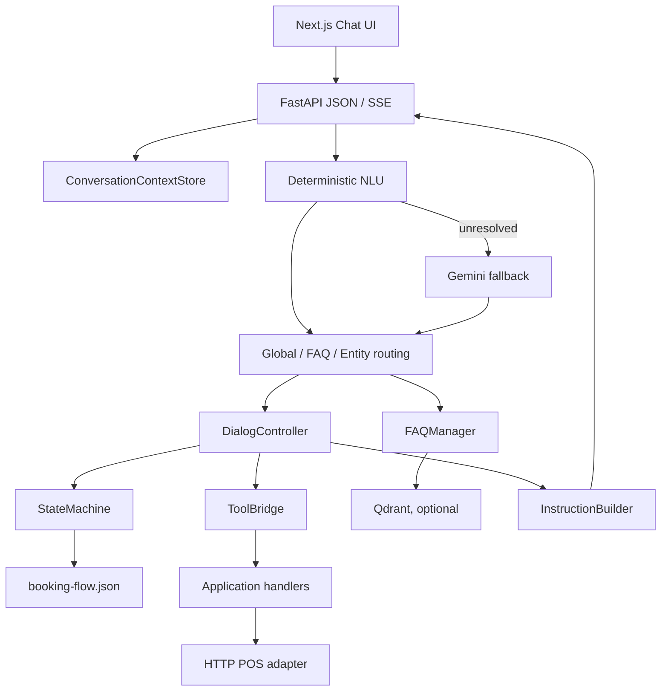

# Kori — Booking AI Chatbot

> Trợ lý hội thoại tiếng Việt giúp khách khám phá dịch vụ và hoàn tất đặt lịch
> wellness qua POS, với workflow xác định, phục hồi lỗi an toàn và FAQ tùy chọn.

Kori kết hợp deterministic NLU, state machine và Gemini fallback để xử lý hội thoại
nhiều lượt. Hệ thống chủ động gợi ý cửa hàng, liệu trình chính, add-on và giờ trống;
POS vẫn là nguồn dữ liệu và transaction chính thức.

```text
Khách hàng → Next.js UI → FastAPI Chatbot → POS Booking API
                              ├── Gemini (NLU fallback)
                              └── Qdrant (FAQ, optional)
```

## Nội dung

- [Tổng quan](#tổng-quan)
- [Luồng trải nghiệm](#luồng-trải-nghiệm)
- [Chạy nhanh](#chạy-nhanh)
- [Cách hệ thống hoạt động](#cách-hệ-thống-hoạt-động)
- [API](#api)
- [Cấu hình](#cấu-hình)
- [Knowledge và Qdrant](#knowledge-và-qdrant)
- [Logging và bảo mật dữ liệu](#logging-và-bảo-mật-dữ-liệu)
- [Kiểm thử](#kiểm-thử)
- [Cấu trúc repository](#cấu-trúc-repository)
- [Giới hạn hiện tại](#giới-hạn-hiện-tại)

## Tổng quan

### Kori làm được gì?

- Duy trì booking context qua nhiều chat turn bằng `conversation_id`.
- Đặt lịch cho một người hoặc nhóm 2–3 người.
- Chọn cửa hàng, ngày, số người, thời lượng, liệu trình chính, add-on, giờ và
  preference kỹ thuật viên.
- Tự tải lựa chọn phù hợp từ POS thay vì buộc khách phải hỏi danh sách.
- Xác minh số điện thoại và yêu cầu final confirmation trước khi tạo booking.
- Hỗ trợ đổi thông tin, bỏ qua add-on, hủy/restart và phục hồi sau lỗi nghiệp vụ.
- Hiểu các intent discovery, FAQ và câu hỏi xen giữa booking flow.
- Trả kết quả qua JSON hoặc POST SSE với cùng business-processing path.
- Ghi dialog trace có correlation nhưng redact dữ liệu nhạy cảm.

### Công nghệ chính

| Thành phần | Công nghệ |
|---|---|
| Frontend | Next.js 16, React 19, TypeScript |
| Backend | Python 3.11+, FastAPI, Pydantic, HTTPX |
| Dialog | JSON state machine, deterministic Vietnamese NLU |
| LLM fallback | Gemini OpenAI-compatible API |
| Booking integration | HTTP POS adapter |
| Knowledge | multilingual MiniLM + Qdrant, optional |
| Persistence hội thoại | In-process memory |
| Tests | Pytest, Mypy, Ruff, Vitest, Playwright |

### Trạng thái hiện tại

| Capability | Trạng thái |
|---|---|
| Single booking | Sẵn sàng |
| Group booking 2–3 người | Sẵn sàng |
| JSON multi-turn | Sẵn sàng |
| POST SSE multi-turn | Sẵn sàng |
| Gemini NLU fallback | Đã tích hợp, cần API key |
| Qdrant FAQ | Tùy chọn qua feature flag |
| Multi-instance context | Chưa hỗ trợ |
| POS authentication | Chưa wire |

Backend checkpoint gần nhất: **1050 tests passed**, Mypy/Ruff/diff check đều pass.

## Luồng trải nghiệm

Một booking thành công đi qua các bước:


```mermaid
flowchart LR
  A[Chọn cửa hàng] --> B[Chọn ngày]
  B --> C[Số người]
  C --> D[Thời lượng]
  D --> E[Liệu trình chính]
  E --> F[Add-on hoặc bỏ qua]
  F --> G[Giờ trống]
  G --> H[Kỹ thuật viên hoặc skip]
  H --> I[Xác minh điện thoại]
  I --> J[Xác nhận cuối]
  J --> K[POS tạo booking]
  K --> L[Completed]
```

Ví dụ hội thoại rút gọn:

```text
Khách: Tôi muốn đặt lịch
Kori:  [tải và hiển thị danh sách cửa hàng]
Khách: Komorebi Ba Đình
Kori:  Bạn muốn đặt vào ngày nào?
Khách: Ngày mai, 1 người, 60 phút
Kori:  [gợi ý liệu trình chính 60 phút]
Khách: Massage đá nóng 60 phút
Kori:  [gợi ý add-on hoặc bỏ qua]
Khách: Không chọn add-on
Kori:  [tải giờ trống từ POS]
...
Kori:  Đặt lịch thành công.
```

Main service và add-on được tách bằng internal mode; add-on không thể bị tìm như
liệu trình chính. Availability và create booking dùng tổng duration authoritative
của các course do POS trả về.

## Chạy nhanh

### 1. Chuẩn bị

- Python 3.11 trở lên
- Node.js phù hợp với Next.js 16
- POS API đang chạy, mặc định tại `http://127.0.0.1:8000`
- Gemini API key nếu muốn bật LLM fallback
- Qdrant chỉ cần khi bật semantic FAQ

### 2. Chạy backend

```powershell
cd D:\Intern_Fsoft\booking-ai-system\booking-ai-chatbot\backend
python -m venv .venv
.\.venv\Scripts\Activate.ps1
python -m pip install -e ".[dev]"
Copy-Item .env.example .env
python -m uvicorn app.main:app --host 127.0.0.1 --port 8001 --reload
```

Cấu hình tối thiểu trong `backend/.env`:

```dotenv
BOOKING_API_URL=http://127.0.0.1:8000

LLM_PROVIDER=gemini
GEMINI_API_KEY=
GEMINI_BASE_URL=https://generativelanguage.googleapis.com/v1beta/openai/
GEMINI_MODEL=gemini-2.5-flash
DIALOG_INTENT_TOOL_ENABLED=true

KNOWLEDGE_QDRANT_ENABLED=false
LOG_LEVEL=INFO
LOG_FORMAT=console
```

Deterministic booking flow vẫn chạy khi Gemini chưa có key; chỉ những câu thật sự
cần fallback mới trả safe recovery.

### 3. Chạy frontend

```powershell
cd D:\Intern_Fsoft\booking-ai-system\booking-ai-chatbot\frontend
npm install
Copy-Item .env.example .env.local
npm run dev
```

Frontend dev chạy tại `http://localhost:3002` và proxy đến backend bằng:

```dotenv
CHATBOT_API_URL=http://localhost:8001
```

### 4. Gửi request đầu tiên

```powershell
$body = @{
  conversation_id = "demo-conversation"
  message = "Tôi muốn đặt lịch"
} | ConvertTo-Json

Invoke-RestMethod `
  -Uri http://127.0.0.1:8001/api/v1/chat `
  -Method Post `
  -ContentType "application/json" `
  -Body $body
```

Nếu Windows báo `WinError 10013` hoặc `10048`:

```powershell
Get-NetTCPConnection -LocalPort 8000,8001 -ErrorAction SilentlyContinue
netsh interface ipv4 show excludedportrange protocol=tcp
```

## Cách hệ thống hoạt động


```mermaid
flowchart TB
  UI[Next.js Chat UI] --> API[FastAPI JSON / SSE]
  API --> CTX[ConversationContextStore]
  API --> NLU[Deterministic NLU]
  NLU -->|unresolved| LLM[Gemini fallback]
  NLU --> ROUTE[Global / FAQ / Entity routing]
  LLM --> ROUTE
  ROUTE --> DC[DialogController]
  DC --> SM[StateMachine]
  SM --> FLOW[booking-flow.json]
  DC --> TB[ToolBridge]
  TB --> HANDLERS[Application handlers]
  HANDLERS --> POS[HTTP POS adapter]
  ROUTE --> FAQ[FAQManager]
  FAQ --> QDRANT[Qdrant, optional]
  DC --> RENDER[InstructionBuilder]
  RENDER --> API
```

Một chat turn được xử lý theo thứ tự:

1. Validate request và lấy `BookingContext` theo `conversation_id`.
2. Chạy global-first deterministic NLU.
3. Chỉ gọi Gemini nếu deterministic result unresolved.
4. Resolve entity qua POS catalog khi cần.
5. `DialogController` chọn transition từ flow JSON.
6. `ToolBridge` chạy typed application actions và rollback context nếu action lỗi.
7. `InstructionBuilder` tạo text, state, status, quick replies và metadata.
8. Lưu context trong memory và trả JSON/SSE.

NLU recognition data nằm tại
[`backend/app/dialog/nlu/catalogs/intent_catalog.vi.json`](backend/app/dialog/nlu/catalogs/intent_catalog.vi.json).
Python `Intent` enum vẫn là contract; transition/action thuộc về flow JSON.

## API

### `POST /api/v1/chat`

Request:

```json
{
  "conversation_id": "web-7f63d2",
  "message": "Tôi muốn đặt lịch",
  "idempotency_key": "client-generated-key"
}
```

Response:

```json
{
  "conversation_id": "web-7f63d2",
  "text": "Bạn muốn chọn cửa hàng nào?",
  "state": "selecting_shop",
  "status": "success",
  "instruction_template": null,
  "quick_replies": [],
  "metadata": {}
}
```

`idempotency_key` là optional ở transport nhưng bắt buộc tại turn tạo booking.

### `POST /api/v1/chat/stream`

Dùng cùng request schema và trả business-level SSE:

```text
started → message → completed
```

JSON và SSE dùng chung `_process_chat_message`, vì vậy state transition và POS side
effect không bị thực thi hai lần. Đây chưa phải token-level streaming.

## Cấu hình

Toàn bộ mẫu cấu hình nằm trong [`backend/.env.example`](backend/.env.example).

Các biến runtime chính:

| Nhóm | Biến |
|---|---|
| POS | `BOOKING_API_URL` |
| Gemini | `GEMINI_API_KEY`, `GEMINI_BASE_URL`, `GEMINI_MODEL` |
| NLU | `DIALOG_INTENT_TOOL_ENABLED` |
| Embedding | `EMBED_MODEL_NAME` |
| Qdrant | `KNOWLEDGE_QDRANT_ENABLED`, `QDRANT_HOST`, `QDRANT_PORT`, `QDRANT_COLLECTION`, `QDRANT_API_KEY` |
| Retrieval | `RAG_HYBRID_SCORE_THRESHOLD` |
| Logging | `LOG_LEVEL`, `LOG_FORMAT`, `LOG_JSON_PATH`, `LOG_MAX_BYTES`, `LOG_BACKUP_COUNT` |
| Privacy | `LOG_FULL_INSTRUCTIONS`, `LOG_RAW_CHAT_MESSAGES` |

Một số biến deployment/product trong `.env.example` chưa được entrypoint wire, ví
dụ POS service key, conversation TTL, CORS, rate limit và audio settings. Chúng chưa
phải capability runtime.

## Knowledge và Qdrant

Qdrant mặc định tắt. Booking không phụ thuộc Qdrant.

```dotenv
KNOWLEDGE_QDRANT_ENABLED=true
QDRANT_HOST=localhost
QDRANT_PORT=6333
QDRANT_COLLECTION=kb_chunks
```

Index knowledge document:

```powershell
cd backend
python -m app.rag.qdrant_indexing --source knowledge/README.md
```

Chỉ dùng `--recreate` khi chủ động muốn xóa và tạo lại collection:

```powershell
python -m app.rag.qdrant_indexing --source knowledge/README.md --recreate
```

FAQ chỉ trả nội dung vượt relevance threshold; nếu knowledge thiếu, hệ thống không
tự sáng tác policy.

## Logging và bảo mật dữ liệu

Console local:

```dotenv
ENVIRONMENT=local
LOG_LEVEL=INFO
LOG_FORMAT=console
```

JSON stdout trong container:

```dotenv
LOG_FORMAT=json
LOG_JSON_PATH=
```

Mỗi turn có trace theo conversation marker đã mask:

```text
[conv:a7f03c21] [Turn] started state=selecting_service
[conv:a7f03c21] [NLU] resolved intent=select_course resolver=deterministic
[conv:a7f03c21] [POS] completed operation=search_services status_code=200
[conv:a7f03c21] [DialogCtrl] transition from_state=selecting_service to_state=selecting_time
[conv:a7f03c21] [Turn] completed state=selecting_time status=success duration_ms=137
```

Formatter redact phone, authorization, API key, secret/token, idempotency key, raw
payload/response, embedding và knowledge content. Raw message/full instruction mặc
định tắt và chỉ được phép bật trong local/development.

## Kiểm thử

Backend:

```powershell
cd backend
python -m pytest -q
python -m mypy app tests --warn-unused-ignores
python -m ruff check app tests
git diff --check
```

Frontend:

```powershell
cd frontend
npm run lint
npm run typecheck
npm test
npm run build
```

## Cấu trúc repository

```text
booking-ai-chatbot/
├── backend/                                  # Python chatbot API và business runtime
│   ├── app/                                  # package source chính của backend
│   │   ├── application/                      # orchestration use case, không phụ thuộc adapter
│   │   │   ├── handlers/                    # từng booking/lookup/change use case
│   │   │   │   ├── search_shop_handler.py
│   │   │   │   ├── search_service_handler.py
│   │   │   │   ├── check_availability_handler.py
│   │   │   │   ├── collect_customer_handler.py
│   │   │   │   ├── confirm_phone_handler.py
│   │   │   │   ├── create_booking_handler.py
│   │   │   │   ├── lookup_booking_handler.py
│   │   │   │   ├── reschedule_booking_handler.py
│   │   │   │   └── cancel_booking_handler.py
│   │   │   ├── ports/                       # contract cho POS, LLM và knowledge
│   │   │   │   ├── booking_gateway.py
│   │   │   │   ├── knowledge_gateway.py
│   │   │   │   └── llm_gateway.py
│   │   │   └── exceptions.py
│   │   ├── core/                             # cấu hình và observability dùng chung
│   │   │   ├── config.py                    # runtime settings + .env loading
│   │   │   └── logging.py                   # console/JSON logging + redaction
│   │   ├── dialog/                           # hiểu input và điều phối một chat turn
│   │   │   ├── flows/                       # khai báo state/transition/change bằng JSON
│   │   │   │   ├── booking-flow.json        # states, transitions, failures
│   │   │   │   └── change-handlers.json     # change-info rules
│   │   │   ├── nlu/catalogs/                # vocabulary nhận diện intent theo ngôn ngữ
│   │   │   │   └── intent_catalog.vi.json   # Vietnamese recognition catalog
│   │   │   ├── dialog_controller.py
│   │   │   ├── entity_resolution.py
│   │   │   ├── flow_loader.py
│   │   │   ├── instruction_builder.py
│   │   │   ├── nlu.py                       # deterministic + Gemini fallback
│   │   │   ├── nlu_catalog.py               # catalog schema/loader
│   │   │   ├── state_machine.py
│   │   │   └── tool_bridge.py
│   │   ├── domain/                           # model và rule booking thuần Python
│   │   │   ├── booking.py
│   │   │   ├── booking_context.py
│   │   │   ├── booking_rules.py
│   │   │   ├── booking_state.py
│   │   │   └── exceptions.py
│   │   ├── infrastructure/                   # concrete adapter cho external systems
│   │   │   ├── booking_api/                 # HTTP mapping giữa chatbot và POS
│   │   │   │   ├── exceptions.py
│   │   │   │   └── http_booking_gateway.py  # POS adapter
│   │   │   ├── cache/                       # lưu conversation context trong process
│   │   │   │   └── memory_cache.py
│   │   │   ├── llm/                         # Gemini implementation của LLMGateway
│   │   │   │   └── gemini_llm_gateway.py
│   │   │   └── vector_db/                   # Qdrant implementation của KnowledgeGateway
│   │   │       └── qdrant_knowledge_gateway.py
│   │   ├── rag/                              # chunk, embed và index knowledge offline
│   │   │   ├── markdown_ingestion.py
│   │   │   ├── qdrant_indexing.py
│   │   │   └── semantic_embedding.py
│   │   ├── sidecar/                          # capability ngoài booking state flow chính
│   │   │   └── faq_manager.py
│   │   ├── transport/                        # FastAPI schemas, JSON endpoint và SSE
│   │   │   ├── chat_api.py                  # JSON + POST SSE endpoints
│   │   │   ├── schemas.py
│   │   │   └── sse.py
│   │   ├── dependencies.py                  # composition root
│   │   └── main.py                          # FastAPI entrypoint
│   ├── data/nlu/                             # corpus dùng phát triển/đánh giá NLU, không phải RAG
│   │   ├── lookups/                         # entity lookup fixtures cho dataset
│   │   ├── intent_catalog.yaml              # inventory intent của offline dataset
│   │   ├── entity_catalog.yaml              # entity schema của offline dataset
│   │   ├── synonyms.yaml                    # synonym groups dùng khi sinh dữ liệu
│   │   ├── utterances.jsonl
│   │   ├── train.jsonl
│   │   ├── validation.jsonl
│   │   ├── test.jsonl
│   │   ├── golden_test.jsonl
│   │   ├── hard_negatives.jsonl
│   │   ├── ambiguous_cases.jsonl
│   │   ├── multi_intent_cases.jsonl
│   │   ├── out_of_scope.jsonl
│   │   ├── human_review.jsonl
│   │   ├── validation-report.json           # output của dataset validation
│   │   └── evaluation-report.json           # output đánh giá deterministic NLU
│   ├── docs/                                 # báo cáo nghiên cứu và chất lượng NLU
│   │   ├── confusion-analysis.md            # phân tích các nhóm intent dễ nhầm
│   │   ├── dataset-report.md                # thống kê và phạm vi NLU dataset
│   │   └── source-research.md               # nguồn/cơ sở xây dựng cách diễn đạt
│   ├── knowledge/                            # nguồn nội dung authoritative cho FAQ/RAG
│   │   └── README.md                        # authoritative Qdrant source
│   ├── scripts/                              # công cụ offline tạo/validate/evaluate NLU data
│   │   ├── generate_nlu_dataset.py
│   │   ├── validate_nlu_dataset.py
│   │   └── evaluate_nlu_dataset.py
│   ├── tests/                                # automated verification của backend
│   │   ├── unit/                            # test từng module/contract cô lập
│   │   │   ├── application/
│   │   │   ├── dialog/
│   │   │   ├── domain/
│   │   │   ├── infrastructure/
│   │   │   ├── rag/
│   │   │   ├── sidecar/
│   │   │   └── transport/
│   │   └── integration/                     # test wiring, flow và transport gần production
│   │       ├── dialog/
│   │       ├── rag/
│   │       └── transport/
│   ├── .env.example
│   ├── chatbot_booking_test_cases.md
│   ├── Dockerfile
│   └── pyproject.toml
├── frontend/                                 # Next.js web chat client
│   ├── app/                                  # App Router, page, layout và server proxy
│   │   ├── api/                             # server-side routes gọi chatbot backend
│   │   │   ├── chat/stream/route.ts         # backend SSE proxy
│   │   │   └── audio/transcriptions/route.ts
│   │   ├── globals.css
│   │   ├── layout.tsx
│   │   └── page.tsx
│   ├── components/                           # React presentation và interaction components
│   │   ├── chat/                            # chat shell, message, composer và header
│   │   └── common/                          # shared icons và error boundary
│   ├── services/                             # API/SSE parsing và client session lifecycle
│   │   ├── chat-api.ts
│   │   └── chat-session.ts
│   ├── types/                                # TypeScript public UI/API contracts
│   │   └── chat.ts
│   ├── e2e/                                  # Playwright browser booking scenarios
│   │   └── chat.spec.ts
│   ├── .env.example
│   ├── Dockerfile
│   ├── package.json
│   ├── playwright.config.ts
│   ├── vitest.config.ts
│   ├── next.config.ts
│   └── tsconfig.json
└── README.md
```

Các file `__init__.py`, test file chi tiết, package lock và generated cache được rút
gọn trong sơ đồ để giữ khả năng đọc; chúng vẫn tồn tại trong repository. Các thư mục
`.venv`, `.next`, `node_modules`, `__pycache__`, `.pytest_cache` và `.ruff_cache`
không phải source nên không được liệt kê.

## Giới hạn hiện tại

- Context nằm trong process memory, mất khi restart và không dùng được cho nhiều
  worker/instance.
- POS authentication/service key chưa được wire.
- Chưa có `/health` endpoint.
- SSE chưa stream theo token.
- POS chưa cung cấp therapist-list API cho chatbot.
- Client cung cấp idempotency key; POS vẫn chịu trách nhiệm idempotency và transaction
  cuối cùng.
- Test records có thể xuất hiện trong shop catalog nếu POS trả chúng như active mà
  không có metadata nhận diện fixture.
- Qdrant chỉ phục vụ FAQ và là external dependency tùy chọn.

## Nguyên tắc ownership

POS là source of truth cho shop/service catalog, availability và booking transaction.
Chatbot sở hữu dialog state, validation trước gateway, recovery và response rendering;
chatbot không truy cập trực tiếp database booking.
