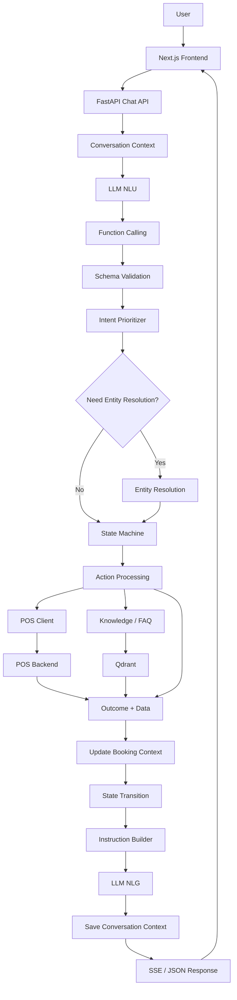

# Kori - Booking AI Chatbot

Trợ lý hội thoại tiếng Việt cho luồng đặt lịch wellness. Chatbot giữ trách nhiệm hiểu tin nhắn, điều phối dialog nhiều turn, gọi POS khi cần và trả phản hồi về frontend qua JSON hoặc SSE.

README này mô tả flow hiện tại theo code trong repository, không giữ lại kiến trúc NLU deterministic/fallback cũ.

## Nội dung

- [Tổng quan kiến trúc](#tổng-quan-kiến-trúc)
- [Chat request flow](#chat-request-flow)
- [Trách nhiệm từng thành phần](#trách-nhiệm-từng-thành-phần)
- [Booking context](#booking-context)
- [POS integration](#pos-integration)
- [RAG integration](#rag-integration)
- [Response generation](#response-generation)
- [SSE và frontend delivery](#sse-và-frontend-delivery)
- [End-to-end example](#end-to-end-example)
- [API](#api)
- [Chạy nhanh](#chạy-nhanh)
- [Cấu trúc repository](#cấu-trúc-repository)

## Tổng quan kiến trúc


```mermaid
flowchart TD
  U[User] --> FE[Next.js Frontend]
  FE --> API[FastAPI Chat API]

  API --> CTX[Conversation Context]
  CTX --> NLU[LLM NLU]

  NLU --> FC[Function Calling]
  FC --> VAL[Schema Validation]
  VAL --> IP[Intent Prioritizer]

  IP --> ER{Need Entity Resolution?}

  ER -- Yes --> RES[Entity Resolution]
  ER -- No --> SM[State Machine]
  RES --> SM

  SM --> ACTION[Action Processing]

  ACTION --> POS[POS Client]
  POS --> POSBE[POS Backend]

  ACTION --> KB[Knowledge / FAQ]
  KB --> QD[Qdrant]

  POSBE --> RESULT[Outcome + Data]
  QD --> RESULT
  ACTION --> RESULT

  RESULT --> CTXUP[Update Booking Context]
  CTXUP --> TRANS[State Transition]

  TRANS --> INST[Instruction Builder]
  INST --> NLG[LLM NLG]

  NLG --> SAVE[Save Conversation Context]
  SAVE --> RESP[SSE / JSON Response]
  RESP --> FE
```

Luồng booking hiện tại tuân theo nguyên tắc:

- Raw user text được đọc bởi `app/dialog/nlu.py::LLMNLU`.
- Backend deterministic chỉ xử lý structured semantics sau NLU.
- `BookingContext` chỉ được commit sau khi business pipeline hoàn tất.
- POS là nguồn dữ liệu nghiệp vụ authoritative cho catalog, availability và booking transaction.
- Qdrant chỉ đi qua nhánh FAQ/RAG, không chạy cho mọi request.

## Chat request flow

Hệ thống chatbot được xây dựng theo kiến trúc hội thoại có trạng thái. Câu hỏi của người dùng trước tiên được xử lý bởi LLM NLU để nhận diện ý định và trích xuất các thực thể cần thiết. Kết quả từ LLM được chuẩn hóa thông qua Function Calling/Structured Output và kiểm tra bằng Pydantic trước khi đưa vào tầng điều phối hội thoại. Intent Prioritizer lựa chọn ý định phù hợp dựa trên kết quả NLU, độ tin cậy và ngữ cảnh hội thoại, trong khi State Machine kiểm tra tính hợp lệ của intent đối với trạng thái hiện tại. Sau đó Router lựa chọn Handler tương ứng. Handler sử dụng dữ liệu trong `BookingContext`, thực hiện các kiểm tra đầu vào và gọi POS Backend hoặc hệ thống Knowledge Base thông qua Qdrant khi cần. Kết quả từ các hệ thống bên ngoài được chuyển thành outcome và dữ liệu nghiệp vụ; `BookingContext` chỉ được cập nhật khi kết quả xử lý hợp lệ. State Machine tiếp tục xác định trạng thái kế tiếp dựa trên outcome. Cuối cùng, Instruction Resolver và NLG Builder tổng hợp instruction, kết quả nghiệp vụ, dữ liệu POS/Qdrant, trạng thái mới, `BookingContext` và lịch sử hội thoại cần thiết để LLM NLG tạo câu trả lời tự nhiên. Response được trả về frontend thông qua JSON hoặc SSE streaming và hiển thị cho người dùng.

Flow end-to-end hiện tại:

```text
User
-> frontend UI
-> frontend route /api/chat hoặc /api/chat/stream
-> backend /api/v1/chat hoặc /api/v1/chat/stream
-> ConversationContextStore.get_copy(conversation_id)
-> LLMNLU.parse(text, state, context)
-> Gemini tool calling / structured output
-> Pydantic validation
-> IntentPrioritizer.choose(...)
-> NLUResult
-> DialogController._process_bound_chat_message(...)
-> nếu cần thì EntityResolutionCoordinator.resolve(...)
-> StateMachine.resolve_transition(...)
-> ActionRegistry.execute_actions(...)
-> handler / PosApiClient / FAQManager
-> HandlerResult / DialogTurnResult
-> InstructionBuilder.build_response(...)
-> ResponseGenerator.generate(...)
-> JSON response hoặc SSE events
-> frontend hiển thị cho user
```

Điểm vào HTTP thật trong code:

- Frontend JSON proxy: `frontend/app/api/chat/route.ts`
- Frontend SSE proxy: `frontend/app/api/chat/stream/route.ts`
- Backend JSON endpoint: `backend/app/transport/chat_api.py::chat`
- Backend SSE endpoint: `backend/app/transport/chat_api.py::chat_stream`

JSON và SSE dùng chung business pipeline qua `chat_api.py::_process_chat_message`, nên không có chuyện chạy dialog logic hai lần chỉ vì khác transport.

## Trách nhiệm từng thành phần

### 1. Transport

`backend/app/transport/chat_api.py`

- Nhận `ChatRequest`
- Lấy `ApplicationContainer`
- Gọi `DialogController.handle_message(...)`
- Map `DialogResponse` sang `ChatResponse`
- Với SSE thì dùng `app/transport/sse.py::stream_chat_events`

Transport không tự hiểu raw message và không chứa booking business logic.

### 2. Conversation context store

`backend/app/dependencies.py::ConversationContextStore`

- Khóa theo `conversation_id`
- Load working copy của `BookingContext`
- Save context sau khi một turn hoàn tất
- Reset context khi cần

`BookingContext` được load trước NLU và chỉ save lại sau khi toàn bộ xử lý turn xong.

### 3. NLU

`backend/app/dialog/nlu.py::LLMNLU`

Flow của NLU:

```text
User text
-> Gemini tool calling / structured output
-> Pydantic validation
-> IntentPrioritizer
-> NLUResult
```

NLU chỉ xử lý câu hiện tại, không trực tiếp tạo booking.

Ví dụ shape output mà NLU hướng tới:

```json
{
  "intent": "select_course",
  "confidence": 0.95,
  "entities": {
    "service_name": "Head Massage"
  }
}
```

Trong code hiện tại:

- `LLMNLU.parse(...)` gọi `self._llm_gateway.generate(..., tools=[_INTENT_TOOL])`
- `_parse_llm_candidates(...)` parse tool output hoặc JSON content
- `LLMNLUOutput` và các model Pydantic validate dữ liệu
- `IntentPrioritizer.choose(...)` chọn candidate phù hợp với state hiện tại

Không còn flow “deterministic NLU trước, Gemini fallback sau” như README cũ.

### 4. Intent Prioritizer

`backend/app/dialog/intent_prioritizer.py::IntentPrioritizer`

Vai trò:

```text
LLM candidates
-> lọc theo StateIntentPolicy
-> ưu tiên candidate đủ entity bắt buộc
-> ưu tiên candidate hợp context
-> chọn intent cuối cùng
```

Hệ thống không lấy thẳng candidate confidence cao nhất rồi dispatch ngay.

### 5. State policy và state machine

- `backend/app/dialog/nlu.py::build_state_intent_policy`
- `backend/app/dialog/state_machine.py::StateMachine`

Trình tự đúng trong code:

```text
NLU result
-> kiểm tra intent có được phép ở state hiện tại không
-> nếu dispatchable thì StateMachine.resolve_transition(...)
-> sau action thành công mới StateMachine.apply_transition(...)
-> sau đó có thể chạy auto transition
```

`StateMachine` không hiểu raw text. Nó chỉ làm việc với:

- `BookingContext.state`
- intent đã được NLU chuẩn hóa
- điều kiện declarative trong `backend/app/dialog/booking_flow.json`
- outcome lỗi từ action qua failure path

### 6. Router và handler orchestration

Trong implementation hiện tại, “router” thực tế là tổ hợp:

- `DialogController._process_bound_chat_message(...)`
- `StateMachine.resolve_transition(...)`
- `ActionRegistry.execute_actions(...)`

`ActionRegistry` là nơi map action name trong flow JSON sang handler/action cụ thể.

Handlers và action layer có thể:

- đọc `BookingContext`
- validate dữ liệu tối thiểu
- resolve entity qua `EntityResolutionCoordinator`
- gọi `PosApiClient`
- map kết quả thành `HandlerResult`
- trả `context_updates` để application áp vào `BookingContext`

Chatbot không nhét core POS business rules vào handler. Handler chỉ orchestration cho turn hiện tại.

### 7. Entity resolution

`backend/app/dialog/nlu.py::EntityResolutionCoordinator`

Khi NLU trả về entity query chưa đủ để dispatch trực tiếp:

```text
NLUResult.resolution_status = ENTITY_RESOLUTION_REQUIRED
-> EntityResolutionCoordinator.resolve(...)
-> SearchShopHandler / SearchCourseHandler / therapist lookup
-> EntityResolutionResult
-> entity_resolution_to_dialog_turn_input(...)
-> DialogController.handle_turn(...)
```

Nhánh này dùng dữ liệu authoritative từ handler/POS thay vì suy đoán bằng keyword.

### 8. Dialog controller

`backend/app/dialog/dialog_controller.py::DialogController`

Vai trò:

- nhận message từ transport
- load và bind context/trace cho turn
- gọi NLU
- stage requested entities nếu user nói nhiều field trong một câu
- route sang nhánh global intent, discovery, FAQ, entity resolution hoặc dialog flow
- gọi `handle_turn(...)`
- build response
- nếu bật `llm_nlg_required` thì gọi NLG
- save context nếu turn không rơi vào `FAILURE_UNHANDLED`

### 9. Instruction builder

`backend/app/dialog/instruction_builder.py::InstructionBuilder`

Đây là lớp “instruction resolver / response draft builder” thực tế trong repo.

Vai trò:

- nhận `DialogTurnResult` + `BookingContext`
- chọn `instruction_template`
- render `DialogResponseDraft`
- build `DialogResponse`
- build grounded NLG prompt qua `build_nlg_prompt(...)`
- build FAQ response qua `build_faq_response(...)`

### 10. LLM NLG

`backend/app/dialog/response_generator.py::ResponseGenerator`

Flow:

```text
InstructionBuilder.build_response(...)
-> InstructionBuilder.build_nlg_prompt(...)
-> Gemini generate(...)
-> DialogResponse text cuối cùng
```

LLM NLG chỉ diễn đạt lại nội dung backend đã kiểm chứng.

NLG không:

- tự chọn business flow
- tự transition state
- tự thêm dữ liệu booking không có trong context

## Booking context

`backend/app/domain/booking_context.py::BookingContext`

`BookingContext` giữ dữ liệu đã tích lũy qua nhiều turn, ví dụ:

```json
{
  "booking_date": "2026-08-10",
  "num_customer": 1,
  "duration_minutes": 60,
  "main_course_name": "Aroma Massage",
  "addons": ["Head Massage"],
  "start_time": "08:00"
}
```

Phân biệt rõ:

```text
NLU entities
= dữ liệu extract từ message hiện tại.

requested_* fields trong BookingContext
= dữ liệu tạm stage từ message hiện tại để hệ thống tiêu thụ theo đúng state.

validated booking fields trong BookingContext
= dữ liệu đã được application/domain/POS chấp nhận.
```

Code hiện tại có hai bước khác nhau:

- `_stage_requested_entities(...)` chỉ stage dữ liệu vào các field như `requested_booking_date`, `requested_main_course_name`
- `ActionRegistry` và handler/action mới commit dữ liệu xác thực vào các field chính như `booking_date`, `main_course`, `start_time`

Vì vậy context không được update bừa ngay sau NLU.

Các state chính hiện có:

- `idle`
- `selecting_shop`
- `selecting_date`
- `selecting_people`
- `selecting_duration`
- `selecting_service`
- `selecting_time`
- `selecting_therapist`
- `collecting_phone`
- `collecting_name`
- `verifying_phone`
- `awaiting_confirmation`
- `booking_executing`
- `completed`
- `booking_failed`
- `cancelled`

## POS integration

Boundary hiện tại:

```text
Chatbot handler/action
-> PosApiClient
-> POS backend
```

POS adapter thực tế:

- `backend/app/infrastructure/pos_api_client.py::PosApiClient`

Handler/action gọi POS cho các nghiệp vụ đang có trong code:

- lấy shop
- tìm course theo shop
- kiểm tra available slots
- tìm therapist available
- kiểm tra customer / phone / blacklist
- tạo booking

Các handler chính đang được wire trong `create_application_container(...)`:

- `SearchShopHandler`
- `SearchCourseHandler`
- `CheckAvailabilityHandler`
- `CheckCustomerHandler`
- `CreateBookingHandler`

POS vẫn là source of truth cho catalog, availability và booking transaction.

## RAG integration

Qdrant không chạy trên mọi request.

Nhánh RAG thực tế:

```text
ask_question
-> FAQManager.answer(...)
-> KnowledgeGateway.search(...)
-> KnowledgeQdrantClient.search(...)
-> InstructionBuilder.build_faq_response(...)
```

Các class liên quan:

- `backend/app/infrastructure/qdrant_client.py::FAQManager`
- `backend/app/infrastructure/qdrant_client.py::KnowledgeQdrantClient`

Nếu request là booking flow bình thường, hệ thống thường đi qua context + POS mà không cần Qdrant.

## Response generation

Pipeline response hiện tại:

```text
DialogTurnResult
-> InstructionBuilder.build_response(...)
-> DialogResponse
-> nếu llm_nlg_required=true:
   ResponseGenerator.generate(...)
-> DialogResponse cuối cùng
-> ChatResponse hoặc SSE event
```

Handler outcome trong code hiện tại đi qua:

- `backend/app/domain/outcomes.py::HandlerOutcome`
- `backend/app/domain/outcomes.py::HandlerResult`

Một số outcome thực tế đang được dùng:

- `SUCCESS`
- `NO_SLOTS`
- `NOT_FOUND`
- `AMBIGUOUS`
- `BLOCKED`
- `INVALID_INPUT`
- `EXTERNAL_FAILURE`

Sau handler/action:

```text
current state
+ intent
+ handler/action result
-> transition hoặc failure route
-> next state
-> instruction template
-> response text
```

## SSE và frontend delivery

Backend:

- JSON endpoint: `POST /api/v1/chat`
- SSE endpoint: `POST /api/v1/chat/stream`
- SSE event lifecycle: `started -> message -> completed`

Frontend:

- `frontend/app/api/chat/route.ts` proxy JSON sang backend
- `frontend/app/api/chat/stream/route.ts` proxy SSE sang backend
- `frontend/services/chat-api.ts` parse JSON hoặc SSE event để cập nhật UI

SSE ở đây là business-level streaming event, không phải token streaming từ LLM.

## End-to-end example

Ví dụ ngắn cho flow thêm add-on:

```text
User:
"Tôi muốn thêm Head Massage"

Current state:
selecting_service

LLMNLU:
intent=select_course
entities.service_name="Head Massage"

IntentPrioritizer:
chọn select_course vì hợp state hiện tại

EntityResolutionCoordinator:
resolve "Head Massage" trong shop hiện tại

DialogController + ActionRegistry:
dispatch action handle_course_selection

BookingContext:
main_course giữ nguyên
addons cập nhật thêm "Head Massage" nếu hợp lệ

StateMachine:
transition theo flow hiện tại

InstructionBuilder:
build response draft cho state tiếp theo

ResponseGenerator:
diễn đạt lại thành câu trả lời tự nhiên
```

Lưu ý: ví dụ trên chỉ minh họa trách nhiệm từng lớp. Next state cụ thể phụ thuộc `booking_flow.json` và dữ liệu context tại thời điểm chạy.

## API

### `POST /api/v1/chat`

Request:

```json
{
  "conversation_id": "web-7f63d2",
  "message": "Tôi muốn đặt lịch",
  "idempotency_key": "optional-client-key"
}
```

Response:

```json
{
  "conversation_id": "web-7f63d2",
  "text": "Bạn muốn đặt lịch tại cửa hàng nào?",
  "state": "selecting_shop",
  "status": "success",
  "instruction_template": "ask_shop",
  "quick_replies": [],
  "metadata": {}
}
```

### `POST /api/v1/chat/stream`

Dùng cùng request schema và trả các event:

```text
started -> message -> completed
```

## Chạy nhanh

### Backend

```powershell
cd D:\Intern_Fsoft\booking-ai-system\booking-ai-chatbot\backend
python -m venv .venv
.\.venv\Scripts\Activate.ps1
python -m pip install -e ".[dev]"
Copy-Item .env.example .env
python -m uvicorn app.main:app --host 127.0.0.1 --port 8001 --reload
```

### Frontend

```powershell
cd D:\Intern_Fsoft\booking-ai-system\booking-ai-chatbot\frontend
npm install
Copy-Item .env.example .env.local
npm run dev
```

Các biến runtime chính cần chú ý:

- `BOOKING_API_URL`
- `GEMINI_API_KEY`
- `GEMINI_BASE_URL`
- `GEMINI_MODEL`
- `GEMINI_FALLBACK_MODEL`
- `DIALOG_INTENT_TOOL_ENABLED`
- `KNOWLEDGE_QDRANT_ENABLED`
- `QDRANT_HOST`
- `QDRANT_PORT`
- `QDRANT_COLLECTION`
- `LOG_LEVEL`

## Cấu trúc repository

```text
booking-ai-chatbot/
├── backend/
│   ├── app/
│   │   ├── application/
│   │   │   ├── action_registry.py
│   │   │   └── handlers/
│   │   ├── dialog/
│   │   │   ├── booking_flow.json
│   │   │   ├── dialog_controller.py
│   │   │   ├── instruction_builder.py
│   │   │   ├── intent_prioritizer.py
│   │   │   ├── nlu.py
│   │   │   ├── response_generator.py
│   │   │   └── state_machine.py
│   │   ├── domain/
│   │   │   ├── booking_context.py
│   │   │   ├── booking_models.py
│   │   │   ├── booking_state.py
│   │   │   └── outcomes.py
│   │   ├── infrastructure/
│   │   │   ├── context_store.py
│   │   │   ├── gemini_client.py
│   │   │   ├── pos_api_client.py
│   │   │   └── qdrant_client.py
│   │   ├── transport/
│   │   │   ├── chat_api.py
│   │   │   ├── schemas.py
│   │   │   └── sse.py
│   │   ├── dependencies.py
│   │   └── main.py
│   └── tests/
└── frontend/
    ├── app/api/chat/
    ├── services/chat-api.ts
    └── types/chat.ts
```

## Nguyên tắc ownership

- `LLMNLU` là nơi duy nhất hiểu raw user text.
- `InstructionBuilder` và `ResponseGenerator` chỉ làm response generation, không quyết định business flow.
- `BookingContext` là nguồn dữ liệu hội thoại nhiều turn của chatbot.
- POS là nguồn dữ liệu nghiệp vụ authoritative.
- Qdrant là capability FAQ tùy nhánh, không phải bước bắt buộc của mọi request.
