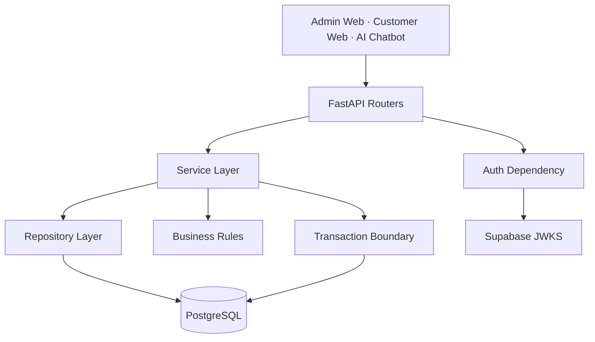

<h1 align="center">Booking AI System Backend</h1>

<p align="center">
  FastAPI backend cho hệ thống quản lý đặt lịch massage, dữ liệu vận hành POS và Admin API.
</p>

<p align="center">
  
  
  
  
  
</p>

<p align="center">
  <a href="#tổng-quan">Tổng quan</a> ·
  <a href="#chức-năng-chính">Chức năng chính</a> ·
  <a href="#kiến-trúc">Kiến trúc</a> ·
  <a href="#xác-thực-admin">Xác thực Admin</a> ·
  <a href="#chạy-local">Chạy local</a>
</p>

---

## Tổng Quan

`booking-ai-system-be` là backend nghiệp vụ của hệ thống booking. Service này chịu trách nhiệm quản lý dữ liệu giao dịch, validate business rule và cung cấp API cho Admin Web, Customer Web và AI Chatbot popup.

Backend không xử lý LLM hay RAG trực tiếp. Các luồng AI, RAG, Qdrant và hội thoại nằm ở service `booking-ai-chatbot`; backend chỉ đóng vai trò nguồn dữ liệu nghiệp vụ chính xác cho booking, catalog, customer và availability.

## Chức Năng Chính

Khả năng | Mô tả
--- | ---
Quản lý catalog | Quản lý cửa hàng, liệu trình, kỹ thuật viên và ca làm việc
Tính slot khả dụng | Tính available slots theo cửa hàng, ngày, số người, thời lượng, liệu trình và kỹ thuật viên
Booking transaction | Tạo, xem, cập nhật trạng thái và hủy booking
Customer eligibility | Kiểm tra khách hàng, số điện thoại, restriction và NG list trước khi đặt lịch
Admin API | Cung cấp API quản trị được bảo vệ bằng Supabase JWT
Public API | Cung cấp API công khai cho chatbot và web khách hàng
Migration | Quản lý schema bằng Alembic
Error contract | Trả lỗi theo chuẩn Problem Details để client xử lý nhất quán

## Kiến Trúc



Nguyên tắc phân lớp:

1. `api` chỉ nhận request, validate schema, gọi service và trả response.
2. `services` sở hữu business rule và transaction boundary.
3. `repositories` chỉ thực hiện truy vấn hoặc ghi dữ liệu, không tự commit hoặc rollback.
4. `schemas` định nghĩa request và response contract bằng Pydantic.
5. `db.models` định nghĩa SQLAlchemy models và relationship.
6. `core` chứa cấu hình, xác thực, exception mapping và integration dùng chung.

## API Boundary

Nhóm API | Mục đích
--- | ---
`api/public` | API công khai cho shop, slot, eligibility, booking và auth
`api/admin` | API quản trị cho shop, course, therapist, shift, restriction, schedule và booking
`api/deps.py` | Dependency dùng chung như database session, UUID parsing và auth guard

Các thao tác quan trọng như tạo booking, hủy booking và kiểm tra eligibility đều đi qua service layer để đảm bảo business rule luôn được áp dụng, kể cả khi caller là web admin hay chatbot.

## Xác Thực Admin

Admin API sử dụng Supabase Auth JWT:

1. Frontend đăng nhập qua Supabase Auth.
2. Frontend gửi access token trong header `Authorization: Bearer <token>`.
3. Backend verify token bằng public key từ `SUPABASE_JWKS_URL`.
4. Email trong token phải nằm trong whitelist `ADMIN_EMAILS`.
5. Nếu token không hợp lệ hoặc email không được cấp quyền, backend trả lỗi xác thực hoặc phân quyền tương ứng.

JWKS URL có dạng:

```text
https://<project-ref>.supabase.co/auth/v1/keys
```

## Database

Backend sử dụng PostgreSQL làm database giao dịch chính. Schema được quản lý bằng Alembic để kiểm soát thay đổi theo version.

Các nhóm dữ liệu chính:

1. Shop, course, therapist và therapist shift.
2. Customer và customer restriction.
3. Booking, reservation và reservation course.
4. Schedule và dữ liệu phục vụ tính slot.

RAG không lưu trong PostgreSQL của backend này. Knowledge retrieval được tách sang chatbot service và Qdrant.

## Chạy Local

Cài dependency:

```powershell
cd D:\Intern_Fsoft\booking-ai-system\booking-ai-system-be
python -m venv .venv
.\.venv\Scripts\Activate.ps1
python -m pip install -e .
Copy-Item .env.example .env
```

Chạy migration:

```powershell
alembic upgrade head
```

Chạy server:

```powershell
uvicorn app.main:app --reload --port 8000
```

## Kiểm Thử

```powershell
pytest
```

Nên chạy test sau khi thay đổi business rule, repository, migration hoặc API contract.

## Cấu Hình Chính

Biến môi trường | Mục đích
--- | ---
`DATABASE_URL` | Chuỗi kết nối PostgreSQL
`SUPABASE_URL` | URL Supabase project
`SUPABASE_SERVICE_KEY` | Service key dùng cho các thao tác backend cần quyền server
`SUPABASE_ANON_KEY` | Anon key Supabase dùng cho integration cần cấu hình client
`SUPABASE_JWKS_URL` | JWKS endpoint dùng để verify JWT
`JWT_ALGORITHM` | Thuật toán verify JWT, mặc định `ES256`
`ADMIN_EMAILS` | Danh sách email admin được phép truy cập Admin API
`CORS_ORIGINS` | Danh sách origin frontend được phép gọi API
`SHOP_TIMEZONE` | Múi giờ nghiệp vụ của cửa hàng
`MINIMUM_BOOKING_ADVANCE_MINUTES` | Số phút tối thiểu phải đặt trước giờ bắt đầu
`APP_ENV` | Môi trường chạy ứng dụng
`LOG_LEVEL` | Mức log runtime

## Ghi Chú Vận Hành

1. Backend là nguồn dữ liệu nghiệp vụ authoritative cho booking.
2. Chatbot có thể gọi backend để lấy shop, course, slot, therapist, customer và tạo hoặc hủy booking.
3. Không đặt logic LLM, RAG hoặc vector search trong backend này.
4. Khi thay đổi schema, luôn tạo migration thay vì sửa database thủ công.
