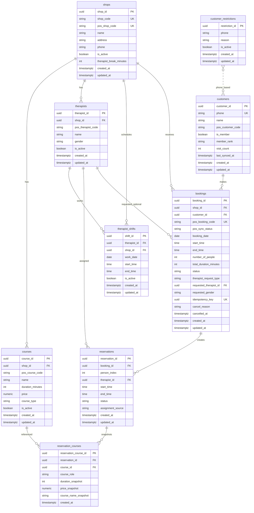

# Reverse Database Từ Source

Tài liệu này được reverse từ SQLAlchemy models trong `booking-ai-system-be/app/db/models`
và đối chiếu với Alembic migrations trong `booking-ai-system-be/alembic/versions`.

## ERD

## Bảng Và Relationship

### `shops`

Vai trò: lưu thông tin cửa hàng.

Khóa:

- PK: `shop_id`
- Unique index: `shop_code`
- Unique index: `pos_shop_code`
- Check constraint: `therapist_break_minutes IN (0, 5, 10, 15)`

Relationship:

- `shops 1 - N courses`
- `shops 1 - N therapists`
- `shops 1 - N therapist_shifts`
- `shops 1 - N bookings`

### `courses`

Vai trò: lưu dịch vụ/liệu trình theo từng cửa hàng.

Khóa:

- PK: `course_id`
- FK: `shop_id -> shops.shop_id`
- Unique composite index: `(shop_id, pos_course_code)`

Relationship:

- `courses N - 1 shops`
- `courses 1 - N reservation_courses`

Ghi chú:

- `course_type` đang dùng giá trị dạng `main` hoặc `addon`.
- Khi booking được tạo, course được snapshot sang `reservation_courses`.

### `therapists`

Vai trò: lưu kỹ thuật viên theo cửa hàng.

Khóa:

- PK: `therapist_id`
- FK: `shop_id -> shops.shop_id`
- Unique composite index: `(shop_id, pos_therapist_code)`

Relationship:

- `therapists N - 1 shops`
- `therapists 1 - N therapist_shifts`
- `therapists 1 - N reservations`
- `therapists 1 - N bookings` thông qua `bookings.requested_therapist_id`, nhưng model chưa khai báo relationship ngược trực tiếp cho field này.

### `therapist_shifts`

Vai trò: lưu ca làm việc của kỹ thuật viên theo ngày.

Khóa:

- PK: `shift_id`
- FK: `therapist_id -> therapists.therapist_id`
- FK: `shop_id -> shops.shop_id`

Relationship:

- `therapist_shifts N - 1 therapists`
- `therapist_shifts N - 1 shops`

### `customers`

Vai trò: lưu khách hàng.

Khóa:

- PK: `customer_id`
- Unique index: `phone`

Relationship:

- `customers 1 - N bookings`

### `bookings`

Vai trò: lưu booking tổng ở cấp lịch hẹn.

Khóa:

- PK: `booking_id`
- FK: `shop_id -> shops.shop_id`
- FK: `customer_id -> customers.customer_id`
- FK nullable: `requested_therapist_id -> therapists.therapist_id`
- Unique index: `pos_booking_code`
- Unique constraint: `idempotency_key`

Relationship:

- `bookings N - 1 shops`
- `bookings N - 1 customers`
- `bookings 1 - N reservations`
- `bookings N - 1 therapists` nếu có `requested_therapist_id`

Cascade:

- `bookings.reservations` có `cascade="all, delete-orphan"` ở ORM.

Ghi chú:

- `pos_booking_code` và `pos_sync_status` được comment là deprecated trong model, nhưng vẫn còn dùng ở một số call site.
- `number_of_people` là số người trong booking.
- Mỗi người trong booking sẽ được tách thành một hoặc nhiều `reservations`.

### `reservations`

Vai trò: lưu assignment thực tế cho từng người trong booking.

Khóa:

- PK: `reservation_id`
- FK: `booking_id -> bookings.booking_id`
- FK: `therapist_id -> therapists.therapist_id`

Relationship:

- `reservations N - 1 bookings`
- `reservations N - 1 therapists`
- `reservations 1 - N reservation_courses`

Cascade:

- `reservations.reservation_courses` có `cascade="all, delete-orphan"` ở ORM.

Ghi chú:

- `person_index` thể hiện người thứ mấy trong nhóm.
- `assignment_source` đang dùng dạng `auto` hoặc `specific`.

### `reservation_courses`

Vai trò: lưu snapshot course tại thời điểm đặt lịch.

Khóa:

- PK: `reservation_course_id`
- FK: `reservation_id -> reservations.reservation_id`
- FK: `course_id -> courses.course_id`

Relationship:

- `reservation_courses N - 1 reservations`
- `reservation_courses N - 1 courses`

Ghi chú:

- Bảng này không dùng `TimestampMixin`, chỉ có `created_at`.
- Các field `duration_snapshot`, `price_snapshot`, `course_name_snapshot` giúp giữ dữ liệu lịch sử nếu course gốc đổi giá/tên/thời lượng.

### `customer_restrictions`

Vai trò: lưu NG list, tức danh sách số điện thoại bị hạn chế đặt booking.

Khóa:

- PK: `restriction_id`
- Index: `phone`
- Partial unique index: `idx_active_restriction_phone` trên `phone` với điều kiện `is_active = true`

Relationship:

- Không có FK trực tiếp tới `customers`.
- Liên hệ logic với `customers.phone` bằng số điện thoại.

Ghi chú:

- Thiết kế này cho phép lưu lịch sử restriction cũ khi `is_active = false`, nhưng chỉ cho phép một restriction active trên cùng một số điện thoại.

## Relationship Theo Luồng Booking

1. Một `shop` có nhiều `courses`, `therapists`, `therapist_shifts`.
2. Một `customer` tạo nhiều `bookings`.
3. Một `booking` thuộc một `shop` và một `customer`.
4. Một `booking` tạo nhiều `reservations`, thường tương ứng từng người trong booking.
5. Mỗi `reservation` được gán một `therapist`.
6. Mỗi `reservation` có nhiều `reservation_courses` để snapshot main course/add-on.
7. `customer_restrictions` được check theo `phone`, không join bằng FK.

