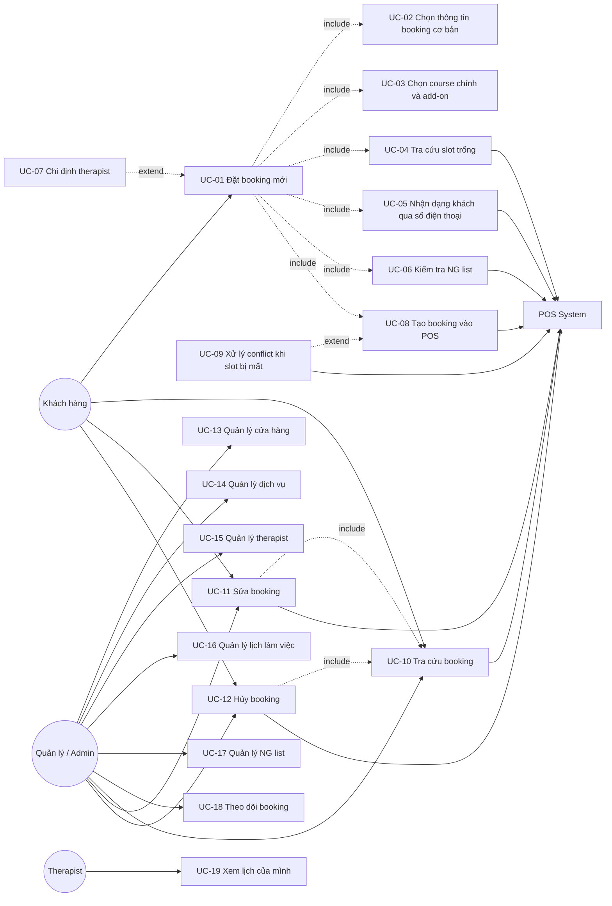
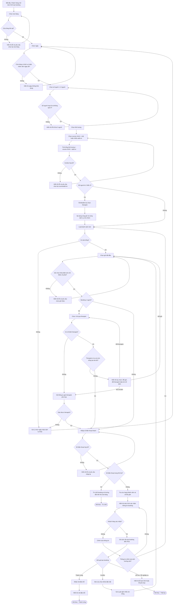
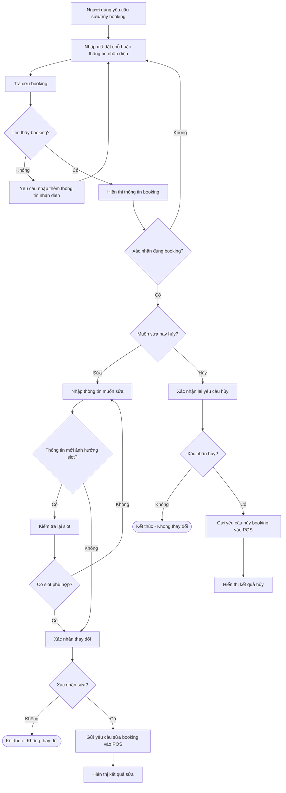

## Hệ thống đặt lịch massage

## 1. Actors

| Actor | Vai trò |
|---|---|
| Khách hàng | Tạo, tra cứu, sửa và hủy booking |
| Therapist | Thực hiện dịch vụ và được gán vào reservation |
| Admin / Manager | Quản lý dữ liệu vận hành |
| POS System | Hệ thống bên ngoài quản lý booking chính thức và cấp mã đặt chỗ |
---
## 3. Use Case Overview

### 3.1. Sơ đồ Use Case tổng đã chỉnh

## 4. Use Case Details
### UC-01 — Đặt booking mới
**Luồng chính:**
1. Khách hàng bắt đầu tạo booking mới.
2. Khách hàng chọn cửa hàng, ngày và số người.
3. Khách hàng chọn thời lượng, course chính và add-on nếu có.
4. Hệ thống tính tổng thời lượng booking.
5. Hệ thống tra cứu slot trống.
6. Khách hàng chọn giờ bắt đầu.
7. Nếu booking 1 người, khách hàng có thể chọn hoặc bỏ qua therapist.
8. Khách hàng nhập số điện thoại.
9. Hệ thống nhận dạng khách hàng và kiểm tra NG list.
10. Hệ thống hiển thị lại toàn bộ thông tin booking.
11. Khách hàng xác nhận thông tin.
12. Hệ thống gọi POS để tạo booking chính thức.
13. Nếu tạo thành công, hệ thống hiển thị mã đặt chỗ.

**Trường hợp ngoại lệ:**

| Trường hợp | Cách xử lý | Quay lại bước/state |
|---|---|---|
| Cửa hàng không tồn tại | Yêu cầu chọn lại cửa hàng | UC-02 |
| Ngày không có dịch vụ hoặc không có nhân viên | Yêu cầu chọn ngày khác | UC-02 |
| Số người vượt quá 3 | Thông báo mỗi booking chỉ hỗ trợ tối đa 3 người | UC-02 |
| Course/add-on không hợp lệ | Yêu cầu chọn lại dịch vụ | UC-03 |
| Không có slot trống | Gợi ý đổi ngày, đổi dịch vụ hoặc đổi thời lượng | UC-02 hoặc UC-03 |
| Therapist không khả dụng | Gợi ý đổi giờ, đổi therapist hoặc bỏ chỉ định | UC-04 hoặc UC-07 |
| Số điện thoại thuộc NG list | Từ chối tạo booking | Kết thúc — Từ chối |
| Slot bị mất khi tạo booking | Chuyển sang xử lý conflict | UC-09 |
| POS lỗi tạm thời | Hiển thị lỗi và không tạo booking | Kết thúc — Thất bại tạm thời |
| Khách hàng chưa xác nhận | Không gọi POS tạo booking | Bước 10 |
| Khách hàng rời khỏi flow | Không tạo booking; có thể lưu draft nếu cần | Draft / Kết thúc |

---

### UC-02 — Chọn thông tin booking cơ bản

**Luồng chính:**
1. Khách hàng chọn cửa hàng.
2. Hệ thống kiểm tra cửa hàng tồn tại.
3. Khách hàng chọn ngày đặt.
4. Hệ thống kiểm tra ngày đó cửa hàng có dịch vụ hoặc nhân viên khả dụng không.
5. Khách hàng chọn số người từ 1 đến 3.

**Business rules:**
- Mỗi cửa hàng hoạt động độc lập.
- Mỗi booking chỉ hỗ trợ tối đa 3 người.
- Booking nhóm là booking từ 2 đến 3 người.
- Booking nhóm không được chỉ định therapist.

**Trường hợp ngoại lệ:**

| Trường hợp | Cách xử lý | Quay lại bước/state |
|---|---|---|
| Không tìm thấy cửa hàng | Yêu cầu chọn lại cửa hàng | Bước 1 |
| Ngày đặt nằm trong quá khứ | Yêu cầu chọn lại ngày hợp lệ | Bước 3 |
| Cửa hàng không hoạt động/ngày không có dịch vụ | Yêu cầu chọn ngày khác | Bước 3 |
| Không có nhân viên làm việc trong ngày đó | Yêu cầu chọn ngày khác | Bước 3 |
| Số người nhỏ hơn 1 hoặc lớn hơn 3 | Hiển thị lỗi giới hạn 1-3 người | Bước 5 |
| Booking nhóm nhưng muốn chỉ định therapist | Hiển thị rule không cho chỉ định therapist với booking nhóm | Bước 5 hoặc tiếp tục không chỉ định therapist |

---

### UC-03 — Chọn course chính và add-on
**Luồng chính:**
1. Khách hàng chọn thời lượng.
2. Khách hàng chọn course chính.
3. Khách hàng chọn một hoặc nhiều add-on nếu có.
4. Hệ thống tính tổng thời lượng.
5. Hệ thống kiểm tra combo course + add-on.
6. Nếu hợp lệ, tiếp tục tra cứu slot.

**Business rules:**
- Add-on chỉ được đi kèm course chính.
- Một booking/reservation có thể có nhiều add-on.
- Add-on làm tăng tổng thời lượng.
- Tổng thời lượng = thời lượng course chính + tổng thời lượng add-on.
- Course nào cũng hỗ trợ booking thêm course/add-on khác. Nếu POS có rule giới hạn combo thì backend cần validate lại khi tạo booking (đề xuất).

**Trường hợp ngoại lệ:**

| Trường hợp | Cách xử lý | Quay lại bước/state |
|---|---|---|
| Chỉ chọn add-on mà chưa có course chính | Yêu cầu chọn course chính trước | Bước 2 |
| Thời lượng không hợp lệ | Yêu cầu chọn lại thời lượng hợp lệ | Bước 1 |
| Course không thuộc cửa hàng đã chọn | Yêu cầu chọn lại course thuộc cửa hàng hiện tại | Bước 2 |
| Course/add-on không khả dụng trong ngày đã chọn | Yêu cầu chọn dịch vụ khác hoặc ngày khác | Bước 2, 3 hoặc UC-02 |
| Combo bị POS/backend từ chối | Yêu cầu chọn lại course/add-on | Bước 2 hoặc 3 |
| Tổng thời lượng thay đổi làm slot cũ không hợp lệ | Load lại slot | UC-04 |

---

### UC-04 — Tra cứu slot trống

**Luồng chính:**
1. Hệ thống nhận thông tin: cửa hàng, ngày, số người, dịch vụ, tổng thời lượng và therapist nếu có.
2. Hệ thống/POS trả danh sách slot khả dụng.
3. Hệ thống hiển thị danh sách slot.
4. Khách hàng chọn giờ bắt đầu.
5. Hệ thống kiểm tra điều kiện đặt trước tối thiểu 15 phút.

**Business rules:**
- Slot phụ thuộc vào cửa hàng, ngày, tổng thời lượng, số người và therapist nếu có.
- Số người tối đa là 3.
- Slot phải đủ dài cho tổng thời lượng booking.
- Slot có thể thay đổi theo thời gian thực.
- Trước khi tạo booking chính thức, POS vẫn có quyền kiểm tra lại availability.

**Trường hợp ngoại lệ:**

| Trường hợp | Cách xử lý | Quay lại bước/state |
|---|---|---|
| Không có slot trống | Gợi ý chọn ngày khác, dịch vụ khác hoặc thời lượng khác | UC-02 hoặc UC-03 |
| Slot không đủ dài | Gợi ý giảm thời lượng, bỏ add-on hoặc chọn giờ khác | UC-03 hoặc Bước 4 |
| Slot không đủ therapist cho booking nhóm | Gợi ý đổi giờ/ngày hoặc giảm số người | UC-02 hoặc Bước 4 |
| Giờ chọn không thỏa đặt trước tối thiểu 15 phút | Yêu cầu chọn giờ khác | Bước 4 |
| Slot vừa hiển thị đã bị người khác đặt mất | Load lại slot và gợi ý slot mới | UC-09 |
| Slot sơ bộ khác slot chính xác | Hiển thị lại danh sách slot chính xác | Bước 2 hoặc 4 |

---

### UC-05 — Nhận dạng khách qua số điện thoại
**Luồng chính:**
1. Khách hàng nhập số điện thoại.
2. Hệ thống tra cứu thông tin khách hàng.
3. Hệ thống xác định khách mới/thành viên.
4. Nếu có dữ liệu, hệ thống hiển thị rank và số lần ghé.

**Business rules:**
- Số điện thoại là thông tin bắt buộc để tạo booking.
- Số điện thoại được dùng để tra cứu thông tin khách hàng và xác minh booking sau này.

**Trường hợp ngoại lệ:**

| Trường hợp | Cách xử lý | Quay lại bước/state |
|---|---|---|
| Số điện thoại không hợp lệ | Yêu cầu nhập lại số điện thoại | Bước 1 |
| Không tìm thấy khách hàng | Xem là khách mới | Tiếp tục UC-06 |
| Không tra cứu được do lỗi hệ thống | Cho phép thử lại hoặc hiển thị lỗi tạm thời | Bước 2 hoặc kết thúc tạm thời |
| Khách không cung cấp số điện thoại | Không cho tạo booking | Bước 1 hoặc kết thúc |

---

### UC-06 — Kiểm tra NG list
**Luồng chính:**
1. Hệ thống kiểm tra số điện thoại trong NG list.
2. Nếu không thuộc NG list, tiếp tục xác nhận booking.
3. Nếu thuộc NG list, hệ thống từ chối tạo booking.

**Business rules:**
- Số điện thoại thuộc NG list không được phép tạo booking.
- NG list hiện là rule/danh sách kiểm tra. Nếu cần quản lý lý do cấm, ngày tạo, người tạo thì tách module quản lý riêng (đề xuất).

**Trường hợp ngoại lệ:**

| Trường hợp | Cách xử lý | Quay lại bước/state |
|---|---|---|
| Số điện thoại thuộc NG list | Từ chối tạo booking và hướng dẫn liên hệ cửa hàng | Kết thúc — Từ chối |
| Không kiểm tra được NG list do lỗi hệ thống | Không tạo booking cho đến khi kiểm tra được hoặc báo lỗi tạm thời | Bước 1 hoặc kết thúc tạm thời |

---

### UC-07 — Chỉ định therapist
**Luồng chính:**
1. Khách hàng chọn therapist theo tên hoặc giới tính.
2. Hệ thống kiểm tra therapist thuộc đúng cửa hàng.
3. Hệ thống kiểm tra therapist có ca làm tại slot đã chọn.
4. Hệ thống kiểm tra therapist còn trống tại slot đó.
5. Nếu hợp lệ, hệ thống gán therapist vào reservation.

**Business rules:**
- Booking nhóm từ 2 đến 3 người không được chỉ định therapist.
- Một therapist tại một thời điểm chỉ phục vụ một khách.
- Nếu khách không chỉ định therapist, hệ thống tự gán therapist phù hợp (đề xuất).
- Nếu chọn theo giới tính và có nhiều therapist phù hợp, hệ thống ưu tiên therapist đúng giới tính, có ca làm, còn trống, ít booking hơn trong ngày hoặc theo thứ tự POS trả về (đề xuất).

**Trường hợp ngoại lệ:**

| Trường hợp | Cách xử lý | Quay lại bước/state |
|---|---|---|
| Booking nhóm nhưng muốn chỉ định therapist | Từ chối chỉ định therapist | UC-02 hoặc tiếp tục không chỉ định |
| Therapist không thuộc cửa hàng | Yêu cầu chọn therapist khác hoặc bỏ chỉ định | Bước 1 |
| Therapist không có ca làm | Gợi ý đổi giờ, chọn therapist khác hoặc bỏ chỉ định | UC-04 hoặc Bước 1 |
| Therapist đã có booking trùng thời gian | Gợi ý đổi giờ, chọn therapist khác hoặc bỏ chỉ định | UC-04 hoặc Bước 1 |
| Không có therapist phù hợp theo giới tính | Gợi ý đổi giờ, đổi giới tính hoặc bỏ chỉ định | UC-04 hoặc Bước 1 |
| Không tự gán được therapist | Gợi ý đổi giờ/ngày hoặc đổi dịch vụ | UC-04 hoặc UC-03 |

---

### UC-08 — Tạo booking vào POS
**Luồng chính:**
1. Khách hàng xác nhận thông tin booking.
2. Hệ thống gửi thông tin booking đến POS.
3. POS kiểm tra lại điều kiện tạo booking.
4. Nếu thành công, POS cấp mã đặt chỗ.
5. Hệ thống hiển thị mã đặt chỗ.

**Kết quả có thể xảy ra:**
- Thành công
- Conflict
- Lỗi nghiệp vụ
- Lỗi tạm thời

**Trường hợp ngoại lệ:**

| Trường hợp | Cách xử lý | Quay lại bước/state |
|---|---|---|
| POS báo slot không còn khả dụng | Chuyển sang xử lý conflict | UC-09 |
| POS báo combo dịch vụ không hợp lệ | Yêu cầu chọn lại dịch vụ | UC-03 |
| POS báo therapist không khả dụng | Yêu cầu đổi therapist, bỏ chỉ định hoặc đổi giờ | UC-07 hoặc UC-04 |
| POS lỗi tạm thời | Hiển thị lỗi và không tạo booking | Kết thúc — Thất bại tạm thời |
| POS phản hồi không rõ ràng sau khi gửi tạo booking | Tra cứu lại booking trước khi retry để tránh tạo trùng (đề xuất) | UC-10 trước khi retry |

---

### UC-09 — Xử lý conflict khi slot bị mất
**Luồng chính:**
1. Hệ thống thông báo slot vừa chọn đã bị mất.
2. Hệ thống load lại danh sách slot khả dụng.
3. Hệ thống gợi ý giờ gần nhất còn trống.
4. Khách hàng chọn giờ mới.
5. Hệ thống xác nhận lại thông tin booking.
6. Hệ thống gọi POS tạo booking lại.

**Trường hợp ngoại lệ:**

| Trường hợp | Cách xử lý | Quay lại bước/state |
|---|---|---|
| Không còn slot phù hợp trong ngày | Gợi ý chọn ngày khác hoặc dịch vụ/thời lượng khác | UC-02 hoặc UC-03 |
| Khách không muốn đổi giờ | Dừng tạo booking | Kết thúc — Chưa tạo booking |
| Slot mới tiếp tục conflict | Load lại slot và gợi ý lại | Bước 2 |
| Đổi giờ làm therapist đã chọn không còn phù hợp | Yêu cầu đổi therapist, bỏ chỉ định hoặc chọn giờ khác | UC-07 hoặc UC-04 |

---

### UC-10 — Tra cứu booking
**Luồng chính:**
1. Người dùng nhập mã đặt chỗ hoặc thông tin nhận diện.
2. Hệ thống tra cứu booking.
3. Nếu tìm thấy, hệ thống hiển thị thông tin booking.
4. Người dùng xác nhận đúng booking cần thao tác.

**Trường hợp ngoại lệ:**

| Trường hợp | Cách xử lý | Quay lại bước/state |
|---|---|---|
| Không tìm thấy booking | Yêu cầu nhập lại thông tin nhận diện | Bước 1 |
| Không nhớ mã đặt chỗ | Cho phép tìm bằng số điện thoại, cửa hàng, ngày/giờ đặt | Bước 1 |
| Có nhiều booking tương tự | Yêu cầu thêm thông tin để phân biệt | Bước 1 |
| Booking đã bị hủy | Hiển thị trạng thái đã hủy, không cho sửa/hủy tiếp | Kết thúc |
| Không đủ thông tin xác minh | Không cho sửa/hủy và hướng dẫn liên hệ cửa hàng | Kết thúc |

---

### UC-11 — Sửa booking
**Luồng chính:**
1. Người dùng tra cứu booking cần sửa.
2. Người dùng nhập thông tin muốn sửa.
3. Hệ thống kiểm tra rule liên quan.
4. Nếu thay đổi ảnh hưởng slot, hệ thống kiểm tra lại slot.
5. Người dùng xác nhận thay đổi.
6. Hệ thống gửi yêu cầu sửa booking vào POS.
7. Hệ thống hiển thị kết quả sửa.

**Trường hợp ngoại lệ:**

| Trường hợp | Cách xử lý | Quay lại bước/state |
|---|---|---|
| Không tìm thấy booking | Tra cứu lại booking | UC-10 |
| Booking đã bị hủy | Không cho sửa | Kết thúc |
| Thông tin mới không hợp lệ | Yêu cầu nhập lại thông tin sửa | Bước 2 |
| Không có slot phù hợp sau khi sửa | Yêu cầu chọn ngày/giờ/dịch vụ khác | Bước 2 hoặc UC-04 |
| Therapist mới không khả dụng | Yêu cầu đổi therapist, bỏ chỉ định hoặc đổi giờ | UC-07 hoặc UC-04 |
| POS từ chối cập nhật | Hiển thị lý do nếu có và yêu cầu chọn lại thông tin | Bước 2 hoặc kết thúc |
| Người dùng không xác nhận thay đổi | Giữ booking cũ | Kết thúc — Không thay đổi |

---

### UC-12 — Hủy booking
**Luồng chính:**
1. Người dùng tra cứu booking cần hủy.
2. Hệ thống hiển thị thông tin booking.
3. Người dùng xác nhận hủy.
4. Hệ thống gửi yêu cầu hủy booking vào POS.
5. Hệ thống hiển thị kết quả hủy.

**Trường hợp ngoại lệ:**

| Trường hợp | Cách xử lý | Quay lại bước/state |
|---|---|---|
| Không tìm thấy booking | Tra cứu lại booking | UC-10 |
| Booking đã bị hủy trước đó | Hiển thị booking đã hủy | Kết thúc |
| Người dùng không xác nhận hủy | Giữ booking hiện tại | Kết thúc — Không thay đổi |
| POS từ chối hủy | Hiển thị lý do nếu có | Kết thúc hoặc UC-10 |
| POS lỗi tạm thời | Hiển thị lỗi tạm thời | Kết thúc — Thất bại tạm thời |

---

### UC-13 — Quản lý cửa hàng
**Luồng chính:**
1. Admin mở màn hình quản lý cửa hàng.
2. Admin xem danh sách cửa hàng.
3. Admin tạo/cập nhật/vô hiệu hóa cửa hàng nếu có quyền.

**Trường hợp ngoại lệ:**

| Trường hợp | Cách xử lý | Quay lại bước/state |
|---|---|---|
| Không có quyền thao tác | Từ chối thao tác | Kết thúc — Không có quyền |
| Cửa hàng không tồn tại | Yêu cầu tìm kiếm lại | Màn hình danh sách |
| Cửa hàng đang có dữ liệu booking liên quan | Không xóa cứng; chỉ vô hiệu hóa nếu nghiệp vụ cho phép (đề xuất) | Màn hình quản lý |

---

### UC-14 — Quản lý dịch vụ
**Luồng chính:**
1. Admin chọn cửa hàng.
2. Admin xem danh sách dịch vụ.
3. Admin tạo/cập nhật/vô hiệu hóa dịch vụ nếu có quyền.

**Trường hợp ngoại lệ:**

| Trường hợp | Cách xử lý | Quay lại bước/state |
|---|---|---|
| Dịch vụ không thuộc cửa hàng | Từ chối cập nhật | Màn hình dịch vụ |
| Add-on không có course chính liên quan | Yêu cầu cấu hình lại | Màn hình dịch vụ |
| Dịch vụ đang được booking sử dụng | Không xóa cứng; chỉ vô hiệu hóa nếu nghiệp vụ cho phép (đề xuất) | Màn hình dịch vụ |

---

### UC-15 — Quản lý therapist
**Luồng chính:**
1. Admin chọn cửa hàng.
2. Admin xem danh sách therapist.
3. Admin tạo/cập nhật/vô hiệu hóa therapist nếu có quyền.

**Trường hợp ngoại lệ:**

| Trường hợp | Cách xử lý | Quay lại bước/state |
|---|---|---|
| Therapist không thuộc cửa hàng | Từ chối cập nhật | Màn hình therapist |
| Therapist đang có booking tương lai | Không xóa cứng; chỉ vô hiệu hóa hoặc xử lý booking liên quan (đề xuất) | Màn hình therapist |

---

### UC-16 — Quản lý lịch làm việc
**Luồng chính:**
1. Admin chọn cửa hàng.
2. Admin chọn therapist.
3. Admin tạo/cập nhật ca làm việc theo ngày và khung giờ.
4. Hệ thống dùng ca làm việc để kiểm tra availability.

**Trường hợp ngoại lệ:**

| Trường hợp | Cách xử lý | Quay lại bước/state |
|---|---|---|
| Ca làm việc trùng hoặc không hợp lệ | Từ chối lưu và yêu cầu chỉnh lại | Màn hình ca làm việc |
| Cập nhật ca làm ảnh hưởng booking đã có | Cảnh báo và yêu cầu xác nhận/xử lý booking liên quan (đề xuất) | Màn hình xác nhận |

---

### UC-17 — Quản lý NG list
**Luồng chính:**
1. Admin mở màn hình NG list.
2. Admin tìm kiếm/thêm/cập nhật/vô hiệu hóa số điện thoại trong NG list nếu có quyền.
3. Hệ thống sử dụng NG list để chặn tạo booking.

**Trường hợp ngoại lệ:**

| Trường hợp | Cách xử lý | Quay lại bước/state |
|---|---|---|
| Số điện thoại không hợp lệ | Yêu cầu nhập lại | Màn hình NG list |
| Admin không có quyền | Từ chối thao tác | Kết thúc — Không có quyền |
| Số đã tồn tại trong NG list | Hiển thị bản ghi hiện có | Màn hình NG list |

---

### UC-18 — Theo dõi booking
**Luồng chính:**
1. Admin mở màn hình theo dõi booking.
2. Admin lọc theo cửa hàng/ngày/trạng thái/khách hàng.
3. Hệ thống hiển thị danh sách booking.
4. Admin xem chi tiết booking nếu cần.

**Trường hợp ngoại lệ:**

| Trường hợp | Cách xử lý | Quay lại bước/state |
|---|---|---|
| Không có booking phù hợp bộ lọc | Hiển thị danh sách rỗng | Màn hình theo dõi |
| Không có quyền xem booking | Từ chối truy cập | Kết thúc — Không có quyền |

---

### UC-19 — Xem lịch của mình
**Luồng chính:**
1. Therapist đăng nhập hệ thống.
2. Therapist mở màn hình lịch của mình.
3. Hệ thống hiển thị ca làm việc và reservation được gán.

**Trường hợp ngoại lệ:**

| Trường hợp | Cách xử lý | Quay lại bước/state |
|---|---|---|
| Therapist không có ca làm trong ngày | Hiển thị lịch trống | Màn hình lịch |
| Therapist không có quyền xem lịch | Từ chối truy cập | Kết thúc — Không có quyền |

---

## 5. User Stories

### 5.1. Customer Stories

| ID | User Story | Acceptance Criteria |
|---|---|---|
| US-01 | Là khách hàng, tôi muốn chọn cửa hàng để đặt đúng nơi mong muốn | Hệ thống xác định được cửa hàng hợp lệ |
| US-02 | Là khách hàng, tôi muốn chọn ngày và giờ đặt lịch | Hệ thống trả được slot phù hợp hoặc báo không còn slot |
| US-03 | Là khách hàng, tôi muốn chọn số người | Hệ thống cho phép chọn từ 1 đến 3 người |
| US-04 | Là khách hàng, tôi muốn chọn course chính và nhiều add-on | Add-on chỉ được chấp nhận khi có course chính |
| US-05 | Là khách hàng, tôi muốn biết tổng thời lượng booking | Tổng thời lượng được tính từ course chính và add-on |
| US-06 | Là khách hàng, tôi muốn chỉ định therapist theo tên hoặc giới tính | Chỉ áp dụng booking 1 người và therapist phải có ca làm |
| US-07 | Là khách hàng, tôi muốn bỏ qua chọn therapist | Hệ thống tự gán therapist phù hợp |
| US-08 | Là khách hàng, tôi muốn hệ thống nhận dạng tôi qua số điện thoại | Hệ thống tra được khách mới/thành viên, rank và số lần ghé nếu có |
| US-09 | Là khách hàng, tôi muốn được báo nếu số điện thoại thuộc NG list | Hệ thống từ chối tạo booking và hướng dẫn liên hệ cửa hàng |
| US-10 | Là khách hàng, tôi muốn nhận mã đặt chỗ sau khi đặt thành công | Hệ thống hiển thị mã đặt chỗ |
| US-11 | Là khách hàng, tôi muốn được gợi ý giờ khác nếu slot bị mất | Hệ thống gợi ý slot gần nhất còn trống |
| US-12 | Là khách hàng, tôi muốn tra cứu booking đã tạo | Hệ thống tìm được booking bằng mã đặt chỗ hoặc thông tin xác minh |
| US-13 | Là khách hàng, tôi muốn sửa booking đã tạo | Booking được cập nhật nếu thông tin mới hợp lệ |
| US-14 | Là khách hàng, tôi muốn hủy booking đã tạo | Booking được hủy sau khi xác nhận |

### 5.2. System Stories

| ID | User Story | Acceptance Criteria |
|---|---|---|
| US-15 | Là hệ thống, tôi cần validate đầy đủ thông tin booking trước khi tạo | Không tạo booking khi thiếu thông tin bắt buộc |
| US-16 | Là hệ thống, tôi cần kiểm tra giới hạn số người trong booking | Không cho tạo booking nếu số người vượt quá 3 |
| US-17 | Là hệ thống, tôi cần kiểm tra điều kiện đặt trước tối thiểu 15 phút | Không cho tạo booking nếu giờ bắt đầu quá sát thời điểm hiện tại |
| US-18 | Là hệ thống, tôi cần tính tổng thời lượng booking | Tổng thời lượng gồm course chính và add-on |
| US-19 | Là hệ thống, tôi cần kiểm tra slot dựa trên thông tin đã có | Slot được kiểm tra lại khi thông tin booking thay đổi |
| US-20 | Là hệ thống, tôi cần kiểm tra NG list trước khi tạo booking | Nếu số điện thoại thuộc NG list thì từ chối tạo booking |
| US-21 | Là hệ thống, tôi cần tự gán therapist khi khách không chỉ định | Therapist được chọn phải có ca làm và còn trống |
| US-22 | Là hệ thống, tôi cần xử lý conflict từ POS | Nếu slot bị mất thì gợi ý giờ khác |
| US-23 | Là hệ thống, tôi cần xử lý lỗi POS | Hiển thị lỗi tạm thời cho người dùng |
| US-24 | Là hệ thống, tôi cần tra cứu booking đã tạo | Tìm được booking để sửa hoặc hủy |
| US-25 | Là hệ thống, tôi cần tránh tạo trùng booking khi phản hồi POS không rõ ràng | Kiểm tra lại booking trước khi retry tạo mới |

### 5.3. Quản lý / Admin Stories

| ID | User Story | Acceptance Criteria |
|---|---|---|
| US-26 | Là Admin, tôi muốn quản lý cửa hàng | Có thể xem/tạo/cập nhật/vô hiệu hóa cửa hàng nếu có quyền |
| US-27 | Là Admin, tôi muốn quản lý dịch vụ theo từng cửa hàng | Có thể xem/tạo/cập nhật/vô hiệu hóa course chính và add-on |
| US-28 | Là Admin, tôi muốn quản lý therapist theo cửa hàng | Có thể xem/tạo/cập nhật/vô hiệu hóa therapist |
| US-29 | Là Admin, tôi muốn quản lý lịch làm việc của therapist | Có thể tạo/cập nhật ca làm việc theo ngày và khung giờ |
| US-30 | Là Admin, tôi muốn quản lý NG list | Có thể thêm/cập nhật/vô hiệu hóa số điện thoại bị cấm nếu có quyền |
| US-31 | Là Admin, tôi muốn theo dõi booking | Có thể xem booking theo cửa hàng, ngày, khách hàng, trạng thái hoặc mã đặt chỗ |

### 5.4. Therapist Stories

| ID | User Story | Acceptance Criteria |
|---|---|---|
| US-32 | Là therapist, tôi muốn xem lịch của mình | Hệ thống hiển thị ca làm việc và reservation được gán |
| US-33 | Là therapist, tôi không nên bị gán booking ngoài ca làm việc | Hệ thống chỉ gán khi therapist có ca phù hợp |
| US-34 | Là therapist, tôi không nên bị gán hai reservation trùng thời gian | Hệ thống kiểm tra trùng lịch trước khi gán |

---

## 6. Process Flow tổng thể

### 6.1. Sơ đồ luồng chính — Đặt booking mới

### 6.2. Sơ đồ luồng phụ — Sửa hoặc hủy booking

